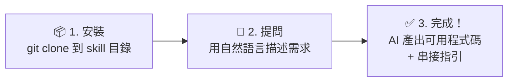

# ECPay API Skill — 綠界科技 AI API整合助手

> **綠界科技官方出品** — 由 ECPay 團隊開發與維護，內容與 API 同步更新。

**當前版本:V2.7**

## 目錄

- [前置需求](#前置需求)
- [這是什麼？](#這是什麼)
- [快速開始](#快速開始)
- [使用範例](#3-使用範例)
- [涵蓋服務](#涵蓋服務)
- [特色](#特色)
- [指南索引](#指南索引)
- [目錄結構](#目錄結構)
- [AI 查詢處理流程](#ai-查詢處理流程guides-與-references-的參照順序)
- [測試環境快速參考](#測試環境快速參考)
- [常見問題](#常見問題)
- [安全政策](#安全政策)
- [API 規格索引（references/）](./references/README.md)
- [授權](#授權)

## 前置需求

使用本 Skill 需要以下任一 AI 程式開發助手：

| 平台 | 需求 | 安裝指引 |
|------|------|---------|
| **VS Code Copilot Chat** | VS Code + GitHub Copilot 訂閱 | [vscode_copilot.md](./vscode_copilot.md) |
| **Visual Studio 2026** | Visual Studio 2026 (v18.0+) + GitHub Copilot | [visual_studio_2026.md](./visual_studio_2026.md) |
| Claude Code | Claude 訂閱或 Anthropic Console API 帳號 | [安裝文件](https://code.claude.com/docs/en/overview) |
| GitHub Copilot CLI | GitHub Copilot 訂閱 | [安裝文件](https://docs.github.com/en/copilot/how-tos/copilot-cli/set-up-copilot-cli/install-copilot-cli) |
| Cursor | Cursor 安裝完成 | [下載頁面](https://cursor.com/download) |
| OpenAI Codex CLI | OpenAI 帳號；`npm install -g @openai/codex` | [SETUP.md §CLI](./SETUP.md#cli-安裝openai-codex-cli--google-gemini-cli) |
| Google Gemini CLI | Google 帳號；`npm install -g @google/gemini-cli` | [SETUP.md §CLI](./SETUP.md#cli-安裝openai-codex-cli--google-gemini-cli) |
| ChatGPT GPTs（custom GPT）| 可建立 GPTs 的 ChatGPT 方案 | [GPT Builder](https://chatgpt.com/gpts/editor) |

## 這是什麼？

ECPay API Skill 是一個 **AI 知識套件**——安裝到 AI 程式開發助手（Claude Code、VS Code Copilot Chat、GitHub Copilot CLI、Cursor 等），或透過 ChatGPT **GPT Builder** 等平台上傳後，AI 就能根據你的需求，直接生成綠界 API 串接程式碼、診斷錯誤、引導完整串接流程。

不需要自己翻文件，用自然語言描述需求即可。

### AI 程式開發助手是什麼？

AI 程式開發助手是安裝在開發者電腦上（終端機或程式碼編輯器內）的 AI 工具，能讀取專案程式碼、用自然語言對話、直接生成或修改程式碼。它不是瀏覽器裡的 ChatGPT——而是嵌入開發工作流程的專業工具。上方「前置需求」表格列出的 Claude Code、VS Code Copilot Chat、GitHub Copilot CLI、Cursor 等都屬於這類工具。

### AI Skill 是什麼？

打個比方：AI 程式開發助手就像一個**聰明但對你的業務一無所知的新進工程師**。AI Skill 就是交給他的「**工作手冊**」——安裝 ECPay API Skill 後，這個 AI 就變成了熟悉綠界全系列 API 的串接專家。

技術上，AI Skill 是一組 Markdown 文件（入口為 SKILL.md），包含決策樹、整合指南、加密範例和官方 API 索引。AI 偵測到 ECPay 相關關鍵字時會自動啟動，依據這些知識回答問題。

### 💼 給管理決策者

| 常見疑問 | 說明 |
|---------|------|
| **為什麼不直接看官方文件？** | 傳統做法：工程師逐頁翻 API 文件 → 理解規格 → 寫程式 → 除錯來回。安裝本 Skill 後：用中文描述需求 → AI 直接產出可用程式碼 + 串接指引，大幅縮短串接週期 |
| **安全嗎？** | 本 Skill 以 **Markdown 知識檔**為核心，不收集任何資料、不連線至第三方伺服器。密鑰由開發者自行管理，從不寫入 Skill 檔案 |
| **程式碼品質有保障嗎？** | 所有範例基於**綠界官方 PHP SDK**（134 個驗證範例），API 規格透過 `references/` 即時連結官網最新版本，不依賴過期文件 |
| **需要額外付費嗎？** | 本 Skill 免費提供參考使用（版權所有，詳見 [LICENSE](LICENSE)） |

### 這個 Skill 能做什麼？

| 能力 | 說明 |
|------|------|
| **需求分析** | 根據你的場景（電商、訂閱、門市、直播等）推薦最適合的 ECPay 方案 |
| **程式碼生成** | 基於 134 個驗證過的 PHP 範例，翻譯為 12 種主流語言（或其他語言） |
| **即時除錯** | 診斷 CheckMacValue 失敗、AES 解密錯誤、API 錯誤碼等串接問題 |
| **完整流程** | 引導收款 → 發票 → 出貨的端到端整合 |
| **上線檢查** | 逐項檢查安全性、正確性、合規性 |

## 快速開始

### 核心術語速查

第一次接觸 ECPay？先看這 5 個核心概念（[完整術語表見 guides/00](./guides/00-getting-started.md#新手必知術語10-項速查)）：

| 術語 | 白話解釋 |
|------|---------|
| **MerchantID** | 你的商店編號（由綠界發給你，金流 / 物流 / 發票各服務帳號不同） |
| **HashKey / HashIV** | 兩把密鑰，加密用的，絕對不能外洩（像你家大門的鑰匙） |
| **CheckMacValue** | 簽名驗證碼——你和綠界雙方各用密鑰算出簽名，對得上才代表資料沒被竄改 |
| **Callback（ReturnURL）** | 綠界付款完成後，從**背景**通知你的伺服器的機制（伺服器對伺服器，不是瀏覽器跳轉） |
| **SimulatePaid** | 設為 `1` 就能模擬付款成功，測試時不用真刷卡 |



**三步驟（純文字版）**：① `git clone` 安裝 Skill → ② 用自然語言描述需求（例：「我要信用卡收款」）→ ③ AI 直接產出可用程式碼 + 串接指引

> 💡 安裝後用中文告訴 AI「我要信用卡收款」，它就會產出完整的程式碼和步驟說明。

### 1. 安裝

> **安裝路徑快速對照**（詳細說明見下方各平台段落）：
>
> | 平台 | 安裝指令 | 驗證方式 |
> |------|---------|---------|
> | **VS Code Copilot Chat** | 下載 ZIP → 用 VS Code 開啟資料夾 → 自動載入，見 [vscode_copilot.md](./vscode_copilot.md) | 同上 |
> | **Visual Studio 2026** | Clone 至專案 + 建立 `.github/copilot-instructions.md`，見 [visual_studio_2026.md](./visual_studio_2026.md) | 同上 |
> | Claude Code | `git clone ...ECPay-API-Skill.git ~/.claude/skills/ecpay` | 同上 |
> | GitHub Copilot CLI | Clone 後將 `.github/copilot-instructions.md` 內容貼至目標專案 | 同上 |
> | Cursor | Clone 至專案 + 建立 `AGENTS.md` 引用 | 同上 |
> | ChatGPT GPTs | 上傳 `SKILL_OPENAI.md` 至 GPT Builder Knowledge | 同上 |
> | OpenAI Codex CLI | 讀取 `AGENTS.md`，見 `SETUP.md` | 同上 |
> | Google Gemini CLI | 讀取 `GEMINI.md`，見 `SETUP.md` | 同上 |

**Claude Code**
```bash
# 個人全域安裝（推薦，所有專案共享）
git clone https://github.com/ECPay/ECPay-API-Skill.git ~/.claude/skills/ecpay

# 或專案層級安裝（僅當前專案）
git clone https://github.com/ECPay/ECPay-API-Skill.git .claude/skills/ecpay
```

> 驗證：開啟 Claude Code，輸入 `/ecpay` 或問「What skills are available?」，確認 ECPay API Skill 出現在清單中。

**VS Code Copilot Chat**

> 💡 **最簡單的安裝方式**：下載 ZIP → 解壓縮 → 用 VS Code 開啟資料夾 → 自動載入，不需要終端機操作。
> 完整圖文步驟見 **[vscode_copilot.md](./vscode_copilot.md)**。

**Visual Studio 2026**（C# / .NET 開發者推薦，支援 Agent Mode）

> 💡 Visual Studio 2026 (v18.0+) 和 2022 (v17.14+) 內建 GitHub Copilot，支援 Custom Instructions、Agent Mode、Prompt Files。GitHub Copilot Free 方案即可使用。
> 完整安裝與使用步驟見 **[visual_studio_2026.md](./visual_studio_2026.md)**。

```bash
# Clone 至專案目錄
git clone https://github.com/ECPay/ECPay-API-Skill.git .ecpay-skill

# 建立 Custom Instructions（將 ECPay API Skill 知識載入 Copilot）
# 見 visual_studio_2026.md 中的 copilot-instructions.md 範本
```

安裝後，在 Copilot Chat 中詢問「綠界 AIO 金流的測試 MerchantID 是多少？」，若回應為 `3002607` 表示 Skill 已載入。

**GitHub Copilot CLI**（終端機工具，適合工程師）

> 💡 **自動載入**：本 repo 的 `.github/copilot-instructions.md` 會被 GitHub Copilot CLI 在此 repo 中工作時**自動讀取**——若你已 clone 本 repo 並在其中開發，Copilot 無需任何額外設定即可感知 ECPay API Skill 知識。
>
> 若要在**其他專案**中使用 ECPay API Skill，需手動將 ECPay API Skill 的指令內容引入你的目標專案：

```bash
# 方式一：Clone 本 repo，再將 .github/copilot-instructions.md 的內容複製到
# 你的目標專案根目錄的 .github/copilot-instructions.md 中（手動貼上，非自動 include）
git clone https://github.com/ECPay/ECPay-API-Skill.git /path/to/ecpay-skill

# 方式二：Clone 到目標專案的子目錄，再手動將 .github/copilot-instructions.md 的
# 完整內容貼至目標專案的 .github/copilot-instructions.md 末尾
git clone https://github.com/ECPay/ECPay-API-Skill.git .github/skills/ecpay
```

> ⚠️ GitHub Copilot CLI 只讀取**專案根目錄**的 `.github/copilot-instructions.md`，不會自動讀取子目錄的 instructions 檔案。因此，clone 到 `.github/skills/ecpay/` 後，需在目標專案的根目錄 `.github/copilot-instructions.md` 中明確引用，Copilot 才能載入 ECPay API Skill 知識。

**Cursor**

> Cursor 使用 `.cursor/rules/` 目錄載入規則，並支援 `AGENTS.md` 自動偵測。

```bash
# 方式一（推薦）：Clone 至專案目錄，Cursor 可透過 AGENTS.md 自動偵測
git clone https://github.com/ECPay/ECPay-API-Skill.git .ecpay-skill
```

Clone 後，在專案根目錄建立或編輯 `AGENTS.md`，加入以下內容：

```markdown
## ECPay API Skill
讀取 `.ecpay-skill/SKILL.md` 作為 ECPay 整合知識庫入口。
完整指南位於 `.ecpay-skill/guides/`（28 份），即時 API 規格索引位於 `.ecpay-skill/references/`。
```

安裝後，在 Cursor 中詢問「綠界 AIO 金流的測試 MerchantID 是多少？」，若回應為 `3002607` 表示 Skill 已載入。

**ChatGPT GPTs（custom GPT）**

1. 開啟 [GPT Builder](https://chatgpt.com/gpts/editor)，建立新的 GPT
2. 在 Configure → **Knowledge**，上傳 `SKILL_OPENAI.md`（檔案超過 8,000 字元，無法貼入 Instructions）
3. 同樣在 **Knowledge**，上傳 `guides/`、`references/` 等關鍵檔案（最多 20 個）
4. 詳細步驟（含建議上傳的檔案清單）見 [`SETUP.md §ChatGPT`](./SETUP.md#chatgpt-gpts-建置)

**其他框架**：將此資料夾放入框架的 skill 目錄。

### 版本固定（生產環境建議）

生產環境建議固定到特定版本以避免非預期的破壞性變更：

```bash
git clone https://github.com/ECPay/ECPay-API-Skill.git ~/.claude/skills/ecpay
cd ~/.claude/skills/ecpay

# 查看所有可用版本（先確認 tag 名稱，再 checkout）
git tag -l

# 固定至指定版本（以 git tag -l 查到的實際 tag 為準）
git checkout v2.7   # 例如：固定至 V2.7

# 之後如需升級
git fetch --tags
git checkout v2.8   # 升級至新版本（以實際發布 tag 為準）
```

> 💡 **目前可用 tag**：`v1.0`、`v2.5`、`v2.6`、`v2.7`（後續版本隨 release 陸續建立）。開發環境使用 `git pull` 取得最新版即可。

### 驗證安裝

安裝完成後，在 AI 助手中輸入以下測試問題，確認 Skill 正確載入：

> 「綠界 AIO 金流的測試 MerchantID 是多少？」

若 AI 回應為「`3002607`」，表示 Skill 運作正常。若 AI 回答不確定或僅給出通用建議，請檢查安裝路徑是否正確。

### 2. 使用

安裝後，在 AI 助手中直接用自然語言提問。提到 ECPay 相關關鍵字時 Skill 會自動啟動：

> ecpay, 綠界, 信用卡串接, 超商取貨, 電子發票, CheckMacValue, 站內付, 金流串接, 物流串接, 定期定額, 綁卡, 退款, 折讓...

**Claude Code 快速指令**（選用）：將 `commands/` 內的 `.md` 檔複製到專案 `.claude/commands/`，即可使用以下 6 個快速指令：

| 指令 | 用途 |
|------|------|
| `/ecpay-pay` | 串接金流（AIO / 站內付 2.0 / 幕後授權）、查詢、退款、Callback |
| `/ecpay-invoice` | 串接電子發票（B2C / B2B / 離線） |
| `/ecpay-logistics` | 串接物流（國內 / 全方位 / 跨境） |
| `/ecpay-ecticket` | 串接電子票證（價金保管 / 純發行） |
| `/ecpay-debug` | 除錯排查 + CheckMacValue/AES 加密驗證 |
| `/ecpay-go-live` | 上線前檢查清單 |

### 3. 使用範例

> 💡 以下範例可**直接複製貼上**給任何 AI 助手使用（含免費模型）。每個 Prompt 已包含完整的測試帳號、環境網址、加密規則與注意事項，無需額外補充即可產出可用程式碼。

**完整 Prompt 範例集（36 個詳盡範例）** → [`docs/prompt-examples.md`](docs/prompt-examples.md)

| 分類 | 範例數 | 涵蓋語言 | 連結 |
|------|--------|---------|------|
| [金流 — AIO 全方位金流](docs/prompt-examples.md#金流--aio-全方位金流) | 7 | Go, Python, TypeScript, Java, C#, Ruby, Kotlin | 信用卡、ATM、超商代碼、分期、定期定額、BNPL、TWQR |
| [金流 — 站內付 2.0](docs/prompt-examples.md#金流--站內付-20) | 4 | Node.js+React, Vue+Express, Swift, Kotlin | 前後端分離、綁卡快速付、iOS/Android App |
| [金流 — 幕後授權 / 查詢 / 退款](docs/prompt-examples.md#金流--幕後授權--查詢--退款) | 4 | Python, Node.js, Go | 幕後取號、訂單查詢、退款、定期定額管理 |
| [電子發票](docs/prompt-examples.md#電子發票) | 4 | Python, Java, C#, Rust | B2C 開立、B2B 開立、折讓、作廢+查詢 |
| [物流](docs/prompt-examples.md#物流) | 4 | C#, Go, TypeScript, PHP | 超商取貨付款、宅配+列印、跨境物流、狀態查詢 |
| [電子票證](docs/prompt-examples.md#電子票證) | 2 | Rust, C++ | 票券發行、核銷+退票 |
| [跨服務整合](docs/prompt-examples.md#跨服務整合) | 2 | Python Django, Node.js | 收款+發票+出貨、訂閱制+自動開發票 |
| [除錯與排查](docs/prompt-examples.md#除錯與排查) | 5 | 通用 | CheckMacValue 失敗、AES 解密亂碼、404 錯誤、Callback 收不到、驗證重試 |
| [上線與環境切換](docs/prompt-examples.md#上線與環境切換) | 1 | 通用 | 測試→正式完整檢查清單 |
| [特殊場景](docs/prompt-examples.md#特殊場景) | 3 | Node.js, Ruby, Swift | POS 刷卡��、直播收款、Apple Pay |

## 涵蓋服務

| 服務 | 內容 | 對應指南 |
|------|------|---------|
| **金流** | AIO 全方位金流（All-In-One）、ECPG 線上金流（站內付 2.0、綁定信用卡代扣、幕後授權、幕後取號） | guides/01-03 |
| **物流** | 國內物流（超商取貨 + 宅配）、全方位物流、跨境物流 | guides/06-08 |
| **電子發票** | B2C（企業對消費者）、B2B（企業對企業，交換 + 存證模式）、離線 | guides/04-05, 18 |
| **電子票證** | 價金保管（使用後核銷 / 分期核銷）、純發行 | guides/09 |
| **購物車** | WooCommerce、OpenCart、Magento、Shopify | guides/10 |
| **POS 刷卡機 + 直播收款** | 實體門市刷卡機串接 / 直播電商收款網址 | guides/17 |

### 支援的付款方式

信用卡一次付清、信用卡分期、信用卡定期定額、ATM 虛擬帳號、超商代碼、超商條碼、WebATM、TWQR、BNPL 先買後付、微信支付、Apple Pay、銀聯

## 特色

- **134 個**經官方驗證的 PHP 範例（可翻譯為 12 種主流語言或其他語言）
- **28 份**深度整合指南（從入門到上線，含 3 個站內付子指南）
- **12 種語言**的加密函式實作（Python、Node.js、TypeScript、Java、C#、Go、C、C++、Rust、Swift、Kotlin、Ruby）
- **19 份**官方 API 技術文件索引 + 1 份索引說明（共計 431 個 URL，可即時查閱原始文件）
- 決策樹自動推薦最適方案
- 跨服務整合場景（收款 + 發票 + 出貨）
- 內建除錯指南和上線檢查清單
- **即時規格更新**——AI 在產生程式碼前會透過 `references/` 即時讀取 `developers.ecpay.com.tw` 最新 API 規格，不依賴過期的靜態文件
- **21 個**跨語言加密測試向量（CheckMacValue × 8、AES × 9、URL Encode × 4），CI 自動驗證（`validate.yml`）
- **6 個 Claude Code 快速指令**（`/ecpay-pay`、`/ecpay-invoice`、`/ecpay-debug` 等）

### 維護工具

- **`scripts/validate-ai-index.sh`**：驗證 guides/13、14、23 中的 AI Section Index 行號是否準確（確認行號指向的行為 `#` 開頭的標題）。維護者更新這些 guide 的章節結構後建議執行此指令碼確認行號索引無誤。
- **`scripts/validate-version-sync.sh`**：驗證 9 個平台入口文件（SKILL.md 為版本來源，另外 8 個被驗證）的版本號是否一致。版本號異動後執行：
  ```bash
  bash scripts/validate-version-sync.sh
  ```
- **`scripts/validate-agents-parity.sh`**：驗證 AGENTS.md（Codex CLI 入口）與 GEMINI.md（Gemini CLI 入口）的決策樹、關鍵規則、測試帳號三大區段是否一致。修改任一文件後執行：
  ```bash
  bash scripts/validate-agents-parity.sh
  ```
- **`test-vectors/verify.py`**：一次驗證所有 21 個加密測試向量（CheckMacValue / AES / URL Encode）。CI（validate.yml）自動執行；本機執行需先安裝依賴後執行：
  ```bash
  pip install pycryptodome
  python test-vectors/verify.py
  ```
- **`scripts/SDK_PHP/`**：官方 ECPay PHP SDK（唯讀參考）。當前版本：**1.3.2506240**（2025-06-24）。若 SDK 有新版請比對 `scripts/SDK_PHP/CHANGELOG.md` 後更新，不要直接修改 SDK 內容。

### CI 自動驗證

本 repo 有兩個 GitHub Actions workflow 守護知識庫完整性，無需人工介入：

#### `validate.yml`（程式碼品質門禁）

**觸發**：PR 送出 或 push 到 `main`，且修改了 `guides/`、`SKILL.md` 等核心文件時自動執行。

依序執行四道檢查，任一失敗 → PR 無法合併：

| 步驟 | 指令碼 | 檢查內容 |
|------|--------|---------|
| 1 | `validate-ai-index.sh` | `guides/13`、`14`、`23` 的 AI Section Index 行號是否仍指向正確的 `#` 標題行（行號錯誤會讓 AI 查到錯誤章節） |
| 2 | `validate-version-sync.sh` | 9 個平台入口文件（SKILL.md、AGENTS.md、GEMINI.md 等）版本號是否完全一致 |
| 3 | `validate-agents-parity.sh` | AGENTS.md（Codex CLI）↔ GEMINI.md（Gemini CLI）的決策樹、關鍵規則、測試帳號三大區段是否相同 |
| 4 | `test-vectors/verify.py` | 21 個加密測試向量（CheckMacValue / AES / URL Encode）的計算結果是否與預期完全吻合 |

#### `validate-references.yml`（外部 URL 可達性）

**觸發**：每週一 UTC 02:00 自動排程，另外修改 `references/` 時或手動觸發也會執行。

以 8 執行緒並行 curl 檢查 `references/` 目錄下全部 431 個 `developers.ecpay.com.tw` URL：

| 結果 | 條件 | 處理 |
|------|------|------|
| `FAIL` | HTTP 狀態碼 ≠ 200 | workflow 失敗，自動開 GitHub Issue（標籤 `url-broken`）告警 |
| `WARN [redirect-domain]` | HTTP 200 但重導向至非 ecpay.com.tw domain | 列出警告，不中斷 |
| `WARN [content-mismatch]` | HTTP 200 但頁面無 ECPay API 關鍵字（MerchantID / HashKey / 介接） | 列出警告，表示頁面內容可能已變更 |

URL 問題修復後，workflow 再次通過時會自動關閉對應 Issue。

> 💡 若需立即檢查 URL 可達性，可至 GitHub Actions 頁籤 → **Validate Reference URLs** → **Run workflow** 手動觸發。

### HTTP 協議模式

ECPay API 使用不同的認證和請求格式，本 Skill 完整涵蓋：

| 模式 | 認證方式 | 請求格式 | 適用服務 |
|------|---------|---------|---------|
| **CMV-SHA256** | CheckMacValue + SHA256 | Form POST | AIO 金流 |
| **AES-JSON** | AES-128-CBC 加密 | JSON POST | ECPG 線上金流、電子發票、全方位/跨境物流、直播收款 |
| **AES-JSON + CMV** | AES-128-CBC + CheckMacValue（SHA256） | JSON POST | 電子票證（CMV 公式與 AIO 不同） |
| **CMV-MD5** | CheckMacValue + MD5 | Form POST | 國內物流 |

> **注意**：直播收款的 API **請求**使用 AES-JSON（無 CMV）；其 ReturnURL **callback 驗證**需使用 ECTicket 式 CheckMacValue（公式同電子票證），詳見 [guides/17 §直播收款](./guides/17-hardware-services.md#直播收款指引)。

## 指南索引

### 入門與全覽

| # | 檔案 | 主題 |
|---|------|------|
| 00 | guides/00-getting-started.md | 從零開始：第一筆交易到上線 |
| 11 | guides/11-cross-service-scenarios.md | 跨服務整合場景（收款+發票+出貨） |

### 金流

| # | 檔案 | 主題 |
|---|------|------|
| 01 | guides/01-payment-aio.md | 全方位金流 AIO（20 個 PHP 範例） |
| 02 | guides/02-payment-ecpg.md | 站內付 2.0 hub（概述 + 付款流程 + 綁卡/查詢/對帳） |
| 02a | guides/02a-ecpg-quickstart.md | 站內付首次串接 + Python/Node.js 完整範例 |
| 02b | guides/02b-ecpg-atm-cvs-spa.md | ATM/CVS 快速路徑 + SPA 整合 |
| 02c | guides/02c-ecpg-app-production.md | App 整合 + Apple Pay + 正式環境 |
| 03 | guides/03-payment-backend.md | 幕後授權 + 幕後取號——ECPG 服務之一 |
| 17 | guides/17-hardware-services.md | 硬體與專用服務指引（POS 刷卡機 + 直播收款） |

### 電子發票

| # | 檔案 | 主題 |
|---|------|------|
| 04 | guides/04-invoice-b2c.md | B2C 電子發票（19 個 PHP 範例） |
| 05 | guides/05-invoice-b2b.md | B2B 電子發票（23 個 PHP 範例） |
| 18 | guides/18-invoice-offline.md | 離線電子發票指引 |

### 物流

| # | 檔案 | 主題 |
|---|------|------|
| 06 | guides/06-logistics-domestic.md | 國內物流（24 個 PHP 範例） |
| 07 | guides/07-logistics-allinone.md | 全方位物流（16 個 PHP 範例） |
| 08 | guides/08-logistics-crossborder.md | 跨境物流（8 個 PHP 範例） |

### 其他服務

| # | 檔案 | 主題 |
|---|------|------|
| 09 | guides/09-ecticket.md | 電子票證 |
| 10 | guides/10-cart-plugins.md | 購物車模組 |

### 跨領域技術參考

| # | 檔案 | 主題 |
|---|------|------|
| 12 | guides/12-sdk-reference.md | PHP SDK 完整參考 |
| 13 | guides/13-checkmacvalue.md | CheckMacValue 解說 + 12 語言實作 |
| 14 | guides/14-aes-encryption.md | AES 加解密解說 + 12 語言實作 |
| 19 | guides/19-http-protocol-reference.md | HTTP 協議參考（跨語言必讀） |
| 20 | guides/20-error-codes-reference.md | 全服務錯誤碼集中參考 |
| 21 | guides/21-webhook-events-reference.md | 統一 Callback/Webhook 參考 |

### 程式語言規範（guides/lang-standards/）

> 生成非 PHP 程式碼時，AI 同時載入目標語言的規範檔。涵蓋命名慣例、型別定義、錯誤處理、HTTP 設定、Callback Handler 模板、URL Encode 注意事項。

| 語言 | 檔案 |
|------|------|
| Python | guides/lang-standards/python.md |
| Node.js | guides/lang-standards/nodejs.md |
| TypeScript | guides/lang-standards/typescript.md |
| Go | guides/lang-standards/go.md |
| Java | guides/lang-standards/java.md |
| C# | guides/lang-standards/csharp.md |
| Kotlin | guides/lang-standards/kotlin.md |
| Ruby | guides/lang-standards/ruby.md |
| Rust | guides/lang-standards/rust.md |
| Swift | guides/lang-standards/swift.md |
| C | guides/lang-standards/c.md |
| C++ | guides/lang-standards/cpp.md |

### 運維與上線

| # | 檔案 | 主題 |
|---|------|------|
| 15 | guides/15-troubleshooting.md | 除錯指南 + 錯誤碼 + 常見陷阱 |
| 16 | guides/16-go-live-checklist.md | 上線檢查清單 |
| 22 | guides/22-performance-scaling.md | 效能與擴展性指引 |
| 23 | guides/23-multi-language-integration.md | 多語言整合（Go/Java/C#/TS/Kotlin/Ruby E2E + Mobile App） |

## 目錄結構

```
ecpay-skill/
├── SKILL.md                    # AI 進入點（Claude Code / Cursor）：決策樹 + 導航
├── SKILL_OPENAI.md             # ChatGPT GPTs（custom GPT）Instructions 設定檔
├── AGENTS.md                   # OpenAI Codex CLI AI 進入點
├── GEMINI.md                   # Google Gemini CLI AI 進入點
├── SETUP.md                    # 統一安裝指南（Codex CLI / Gemini CLI / ChatGPT GPTs）
├── README.md                   # 本文件
├── CONTRIBUTING.md             # 貢獻指南
├── SECURITY.md                 # 安全政策（漏洞通報、憑證安全須知）
├── LICENSE                     # All Rights Reserved
├── .github/                    # GitHub 社群模板（Issue/PR 模板、CI workflow）
│   └── copilot-instructions.md # VS Code Copilot Chat / GitHub Copilot CLI AI 自動載入入口（在此 repo 工作時自動生效）
├── test-vectors/               # 跨語言加密驗證用測試向量（CMV + AES + URL Encode，共 21 個）
│   └── verify.py               # 一鍵驗證所有向量（pip install pycryptodome 後執行）
├── commands/                   # Claude Code 快速指令（6 個 /ecpay-* 指令）
├── guides/                     # 28 份深度整合指南（ChatGPT GPTs 依 SETUP.md §ChatGPT 選擇上傳子集）
│   └── lang-standards/         # 12 語言程式規範（Python/Node.js/TS/Go/Java/C#/Kotlin/Ruby/Rust/Swift/C/C++）
├── references/                 # 官方 API 文件 URL 索引（19 個檔案，431 個 URL）— AI 即時讀取入口
│   ├── Payment/   (8 個)
│   ├── Invoice/   (4 個)
│   ├── Logistics/ (3 個)
│   ├── Ecticket/  (3 個)
│   └── Cart/      (1 個)
└── scripts/
    ├── validate-ai-index.sh    # AI Section Index 行號驗證指令碼
    └── SDK_PHP/                # 官方 PHP SDK + 134 個範例
        └── example/
            ├── Payment/Aio/        (20 個)
            ├── Payment/Ecpg/       (24 個)
            ├── Invoice/B2C/        (19 個)
            ├── Invoice/B2B/        (23 個)
            ├── Logistics/Domestic/ (24 個)
            ├── Logistics/AllInOne/ (16 個)
            └── Logistics/CrossBorder/ (8 個)
```

## AI 查詢處理流程：guides/ 與 references/ 的參照順序

AI 助手在回答開發者問題時，依循以下順序參照知識庫：

### 第一層：SKILL.md 決策樹（路由）

```
開發者提問 → SKILL.md 決策樹分析需求
  ├── 判斷服務類型（金流 / 物流 / 發票 / 票證）
  ├── 判斷協議模式（CMV-SHA256 / AES-JSON / AES-JSON+CMV / CMV-MD5）
  └── 路由到對應的 guide + reference
```

### 第二層：guides/（靜態整合知識）

```
guides/XX-*.md  →  了解「怎麼做」
  ├── 整合流程與架構邏輯
  ├── 程式碼範例與常見陷阱
  └── 參數表（標記為 SNAPSHOT，僅供理解用）
```

### 第三層：references/（即時 API 規格）

```
references/*/  →  取得「最新規格」
  ├── 讀取 reference 檔案 → 找到對應 URL
  ├── 使用平台工具存取 developers.ecpay.com.tw
  └── 取得最新端點、參數定義、回應格式
```

### 完整查詢流程

```
1. SKILL.md 決策樹  ──→  判斷需求，路由到對應 guide
2. guides/XX         ──→  讀取整合流程、架構邏輯、注意事項
3. scripts/SDK_PHP/  ──→  讀取官方 PHP 範例作為翻譯基礎（需要產生程式碼時）
4. references/       ──→  ⭐ 即時存取最新 API 規格（產生程式碼前必做）
5. guides/13 或 14   ──→  加密實作參考（CheckMacValue 或 AES）
6. test-vectors/     ──→  提供測試向量供驗證
```

> **核心原則**：`guides/` 告訴 AI「怎麼串接」，`references/` 告訴 AI「串接什麼」。
> 產生 API 呼叫程式碼前，**必須**透過 `references/` 取得最新規格，不可僅依賴 `guides/` 中的 SNAPSHOT 參數表。

### 各平台 AI 入口點

不同 AI 平台各自讀取對應的入口檔案，理解這個對應關係有助於正確設定和排查問題：

| 平台 | AI 入口點 | 說明 |
|------|---------|------|
| Claude Code、Cursor | `SKILL.md` | 主要決策樹：安裝後 AI 自動讀取 |
| VS Code Copilot Chat | `.github/copilot-instructions.md` | 用 VS Code 開啟資料夾後**自動載入**，見 [vscode_copilot.md](./vscode_copilot.md) |
| GitHub Copilot CLI | `.github/copilot-instructions.md` | 在此 repo 工作時**自動載入**，無需手動引用 |
| OpenAI Codex CLI | `AGENTS.md` | 濃縮版入口，隨 Codex CLI 設定自動載入 |
| Google Gemini CLI | `GEMINI.md` | 濃縮版入口，含 Google Search 策略說明 |
| ChatGPT GPTs | `SKILL_OPENAI.md` | 上傳至 GPT Builder Knowledge 欄位 |

### 各平台存取 references/ 的方式

| 平台 | 存取工具 | 方式 |
|------|---------|------|
| Claude Code | `web_fetch` | 直接讀取 reference URL |
| VS Code Copilot Chat | `#file` + `@workspace` | 引用本地 guides/，搭配 `@workspace` 搜尋整個知識庫 |
| GitHub Copilot CLI | `web_fetch` / `fetch` | 直接讀取 reference URL |
| Cursor | `@web` / Fetch MCP | 直接讀取 reference URL |
| OpenAI Codex CLI | `web_fetch` | 直接讀取 reference URL |
| Google Gemini CLI | `web_fetch` / Google Search | 直接讀取 reference URL，或以 `site:developers.ecpay.com.tw` + API 名稱搜尋 |
| ChatGPT GPTs | Web Search | 以 `site:developers.ecpay.com.tw` + API 名稱搜尋 |

> **ChatGPT GPTs 注意**：無法直接讀取 `references/` 中的 URL，改用 Web Search 搜尋官方文件。
> 若 Web Search 無法取得結果，以 `guides/` SNAPSHOT 為備援並標示「此為 SNAPSHOT，可能非最新版本」。

## 測試環境快速參考

無需申請，使用以下共用測試帳號即可立即開始開發：

| 服務 | MerchantID | HashKey | HashIV | 協定 |
|------|-----------|---------|--------|------|
| **金流（AIO / 站內付 2.0 / 幕後授權）** | `3002607` | `pwFHCqoQZGmho4w6` | `EkRm7iFT261dpevs` | SHA256 / AES |
| **電子發票** | `2000132` | `ejCk326UnaZWKisg` | `q9jcZX8Ib9LM8wYk` | AES |
| **物流 B2C / 全方位 / 宅配** | `2000132` | `5294y06JbISpM5x9` | `v77hoKGq4kWxNNIS` | MD5 / AES |
| **物流 C2C** | `2000933` | `XBERn1YOvpM9nfZc` | `h1ONHk4P4yqbl5LK` | MD5 |
| **電子票證** | `3085676` | `7b53896b742849d3` | `37a0ad3c6ffa428b` | AES+CMV |

> 💡 **快速測試提示**：建立訂單時設定 `SimulatePaid=1`，無需真實信用卡即可模擬付款成功。
> ⚠️ **注意**：金流、物流、發票使用**不同** HashKey / HashIV，切勿混用。

測試信用卡：`4311-9522-2222-2222`，CVV：任意 3 位，有效期：任意未來日期，3DS：`1234`。

完整帳號（含離線發票、電子票證平台商等）見 [guides/00-getting-started.md §測試帳號](./guides/00-getting-started.md)。

## 常見問題

**Q：不用 PHP 可以嗎？**
A：可以。本 Skill 支援 12 種語言的加密函式實作，並提供 HTTP 協議參考（guides/19）讓其他語言也能從零實作。PHP 範例作為翻譯基底，AI 會自動轉換為你的目標語言。

**Q：AIO 和站內付 2.0 怎麼選？**
A：AIO 會跳轉到綠界付款頁，整合最簡單；站內付 2.0 讓消費者在你的網站內完成付款，適合前後端分離架構（React/Vue/Angular）。詳見 guides/01 和 guides/02。

**Q：Callback（付款通知）收不到怎麼辦？**
A：參考 guides/15 §2 排查流程 + guides/21 各服務 Callback 格式彙總。常見原因：URL 不可達、未回應 `1|OK`、防火牆擋 ECPay IP。

**Q：怎麼從測試環境切換到正式環境？**
A：參考 guides/16 上線檢查清單，逐項替換 MerchantID、HashKey/HashIV、API domain。

**Q：AI 生成的程式碼可以直接使用嗎？**
A：AI 基於 134 個官方驗證的 PHP 範例和 12 語言加密實作生成程式碼，品質高但仍建議人工驗證。特別是金額、加密邏輯、Callback 處理等關鍵路徑應搭配測試環境驗證。

**Q：Skill 教客戶的加密程式碼（CheckMacValue / AES）怎麼保證正確？會不會有 bug？**
A：每次 Skill 發布前都會自動跑 **21 組跨語言加密測試向量**（`test-vectors/verify.py`），涵蓋 CheckMacValue（SHA256 / MD5）、AES-128-CBC 加密/解密、URL Encode 差異等所有核心演算法。21/21 全部通過才能發布；任何加密演算法錯誤會在 CI 階段就被攔下，不會進入客戶環境。白話說明（為什麼需要、如果沒有會怎樣、誰要關心）請見 [`test-vectors/README.md`](./test-vectors/README.md)，FAE 可直接引用該文件回覆客戶的品質疑慮。

**Q：API 規格更新時，AI 會讀到最新的嗎？**
A：會。`references/` 目錄存放 431 個指向 `developers.ecpay.com.tw` 的 URL 索引（不是靜態副本），AI 會即時讀取最新官方規格。ChatGPT GPTs 因平台限制改以 Web Search 替代。

## 相關資源

- [綠界科技官網](https://www.ecpay.com.tw)
- [開發者文件](https://developers.ecpay.com.tw)
- [PHP SDK GitHub](https://github.com/ECPay/ECPayAIO_PHP)

## 驗證與來源

本 Skill 基於綠界科技官方 API 技術文件及官方 PHP SDK 開發。如需驗證內容準確性：

1. **API 規格**：比對 [developers.ecpay.com.tw](https://developers.ecpay.com.tw) 官方文件
2. **PHP SDK**：比對 [ECPay 官方 GitHub](https://github.com/ECPay/ECPayAIO_PHP) 的範例程式碼
3. **技術諮詢**：聯繫綠界科技 系統分析部 sysanalydep.sa@ecpay.com.tw 確認

## 聯繫我們

| 用途 | 聯繫方式 |
|------|---------|
| Skill 技術諮詢 | sysanalydep.sa@ecpay.com.tw（綠界科技 系統分析部）|

## 貢獻

歡迎貢獻！詳見 [CONTRIBUTING.md](./CONTRIBUTING.md)。

## 安全政策

安全漏洞通報與憑證安全須知請見 [SECURITY.md](./SECURITY.md)。

## 已知限制

- 僅支援新台幣（TWD）
- references/ URL 索引需要網路連線才能即時讀取最新 API 規格
- ChatGPT GPTs 無法直接讀取 references/ 檔案（透過 Web Search 替代，可靠性略低於 web_fetch 直讀）
- AI 翻譯品質可能因模型與語言組合而異，生成的程式碼片段應經人工驗證

## 授權

All Rights Reserved — 詳見 [LICENSE](LICENSE)

本著作之一切著作權及智慧財產權歸綠界科技股份有限公司所有。您可檢視、研讀及搭配 AI 編程助手參考使用，但不得重新散布、轉授權或建立衍生著作用於商業銷售。
