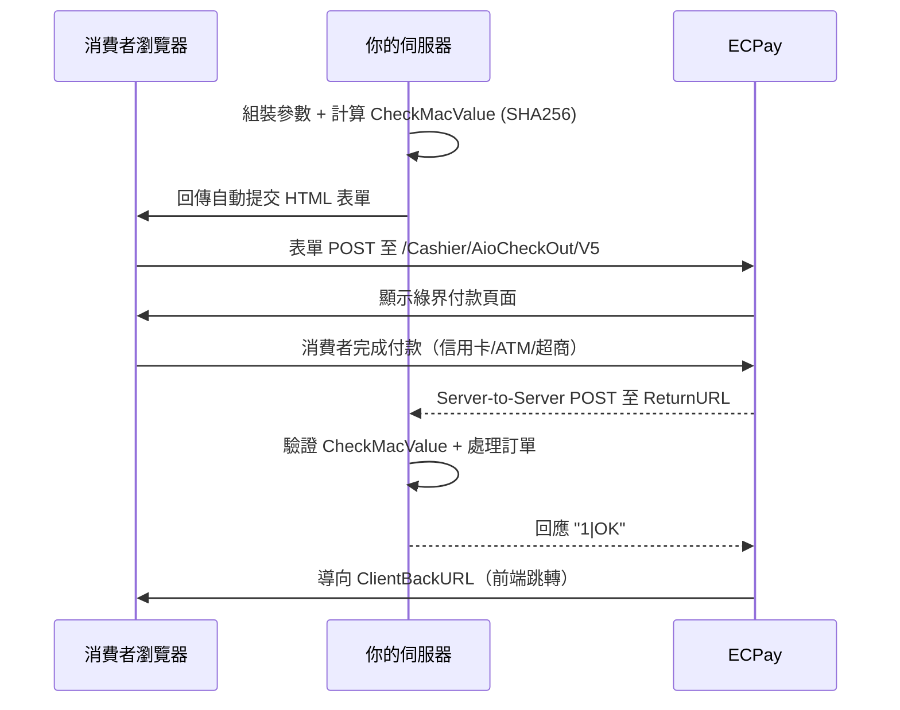
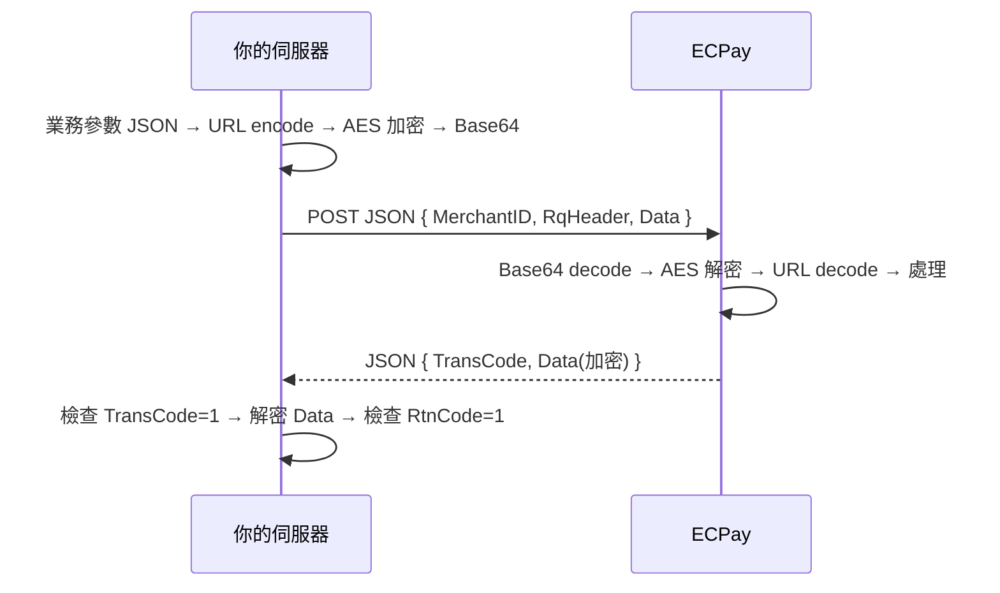

> 對應 ECPay API 版本 | 基於 PHP SDK ecpay/sdk | 最後更新：2026-03

# 從零開始：第一筆交易到上線

> ### 30 秒速查
>
> | 項目 | 內容 |
> |------|------|
> | **測試商店編號** | 金流 `3002607` / 發票·物流 `2000132` |
> | **最快測試路徑** | 信用卡一次付清 + `SimulatePaid=1` → [§AIO 全方位金流首次測試路徑](#aio-全方位金流首次測試路徑) |
> | **預計完成時間** | PHP 30 分鐘 / Python·Node.js 45 分鐘 / Java·C# 60 分鐘 |
> | **非 PHP 必讀** | [guides/13](./13-checkmacvalue.md) + [guides/14](./14-aes-encryption.md) + [guides/19](./19-http-protocol-reference.md) |
> | **遇到問題** | [guides/15](./15-troubleshooting.md)（按症狀）或 [guides/20](./20-error-codes-reference.md)（按錯誤碼） |

## 新手必知術語（10 項速查）

第一次接觸 ECPay？先看這張表，之後讀文件就不會卡住：

| 術語 | 白話解釋 |
|------|---------|
| **MerchantID** | 你的商店編號（綠界發給你的，測試用 `3002607`） |
| **HashKey / HashIV** | 兩把密鑰，像你家大門的鑰匙，加密用的，絕對不能外洩 |
| **AIO** | All-In-One 金流，消費者會跳到綠界頁面付款，最常用的方案（約 60% 商家使用） |
| **ECPG** | EC Payment Gateway 的簡稱，即綠界的**線上金流服務**，涵蓋站內付 2.0（Web/App）、綁定信用卡、幕後授權、幕後取號等服務。注意：ECPG ≠ 站內付 2.0。POS 刷卡機屬於線下金流，不在 ECPG 範圍內 |
| **CheckMacValue** | 簽名驗證碼——你和綠界雙方各自用密鑰算出一個簽名，對得上才代表資料沒被竄改 |
| **AES 加密** | 進階加密方式——把整段資料用密鑰鎖起來再傳送（ECPG、發票、物流 v2 用這個） |
| **ReturnURL** | 你的伺服器接收通知的網址——綠界付款完成後，會從背景 POST 通知到這個 URL |
| **Callback** | 跟 ReturnURL 同義，就是綠界從後台通知你「付款完成了」的機制 |
| **ClientBackURL** | 消費者付完款後，瀏覽器自動跳回的前端頁面（不是通知你的伺服器，是給消費者看的） |
| **SimulatePaid** | 設為 1 就能模擬付款成功，測試時不用真刷卡 |

> 📝 **術語慣例**：本套件中所有技術術語（CheckMacValue、RtnCode、TransCode、MerchantID、HashKey、HashIV 等）一律使用**英文原名**，不做翻譯，以利跨語言開發者搜尋和比對 API 文件。

> 🎯 **最重要的一件事**：ReturnURL 是**伺服器對伺服器**的背景通知，ClientBackURL 是**瀏覽器跳轉**。兩者用途完全不同，不可搞混。

## 概述

本指南帶你跑通第一筆 ECPay 測試交易。PHP 開發者約 30 分鐘可完成基礎串接（含 SimulatePaid 模擬付款），非 PHP 開發者約 45-60 分鐘。

> 🎯 **最快測試路徑（無需 ReturnURL）**：
> 1. 建立訂單時設定 `SimulatePaid=1`
> 2. `ReturnURL` 填任意 HTTPS URL（如 `https://example.com/notify`）
> 3. 前端完成模擬付款流程後，用 QueryTradeInfo API 主動查詢訂單狀態
> 4. 確認流程正確後，再設定真實的 ReturnURL 接收 callback
>
> 此路徑無需 ngrok、無需公開 URL，適合首次快速驗證。
>
> ⚠️ **此路徑不測試 ReturnURL callback**：若你的訂單狀態、庫存、發票等業務邏輯依賴 ReturnURL callback 通知，請改用 ngrok 方案（見下方「本地開發環境」）進行完整測試。完整本地開發環境設定（ngrok / Cloudflare Tunnel / RequestBin）見 [guides/24 本地開發環境設定](./24-local-development.md)。
>
> **SimulatePaid 後的下一步**：SimulatePaid=1 驗證了前端流程。完成後建議：
> 1. 設定 [ngrok](https://ngrok.com)（`ngrok http 3000`）取得公開 HTTPS URL
> 2. 將 ReturnURL 改為 ngrok URL，移除 `SimulatePaid=1`
> 3. 用測試信用卡 `4311-9522-2222-2222` 完成一筆真實付款
> 4. 確認 ReturnURL 收到 callback 並正確回應 `1|OK`
>
> 詳細設定見 [guides/24 本地開發環境](./24-local-development.md)。

## ECPay 五大服務

| 服務 | 說明 | 適用場景 |
|------|------|---------|
| 金流 | 信用卡、ATM、超商代碼、條碼、WebATM、TWQR、BNPL、微信、Apple Pay、銀聯 | 線上收款（AIO / ECPG）；線下收款（POS 刷卡機） |
| 物流 | 超商取貨（全家/統一/萊爾富/OK（僅 C2C））、宅配（黑貓/郵局）、跨境 | 商品配送 |
| 電子發票 | B2C、B2B（交換/存證模式）、離線 | 合規開票 |
| 電子票證 | 價金保管（使用後核銷/分期核銷）、純發行 | 票券、餐券、遊樂園 |
| 購物車 | WooCommerce、OpenCart、Magento、Shopify 模組 | 現成電商平台 |

## 金流合約模式：代收付（大特店）vs 新型閘道

ECPay 金流提供兩種合約模式。**API 技術規格完全相同**，差異僅在商務面（簽約對象、款項撥付、可用服務數量）。

> 完整對照表見 [SKILL.md §代收付 vs 新型閘道模式](../SKILL.md#代收付大特店vs-新型閘道模式金流方案選擇前必讀)。
> **快速結論**：不確定選哪個？**先用代收付模式**（門檻最低、服務最全）。新型閘道模式適合需要 AMEX/國旅卡的大型商戶。
> 新型閘道同時提供 **7 家銀行**的閘道服務，涵蓋市場約 **80%** 的信用卡。完整付款方式 × 金流服務支援矩陣見 [SKILL.md §付款方式 × 金流服務 支援矩陣](../SKILL.md#付款方式--金流服務-支援矩陣)。

## 商務申請流程

> 💡 **立即開始開發**：下方共用測試帳號（MerchantID: 3002607）**無需申請、立即可用**。
> 建議邊開發邊申請專屬帳號，不必等審核通過才動手。

1. **立即開始開發** — 使用下方共用測試帳號，無需等待任何申請
2. 至 [綠界科技官網](https://www.ecpay.com.tw) 申請帳號並提交營業登記相關文件
3. 審核通過後取得正式 **MerchantID**、**HashKey**、**HashIV**
4. 上線前將程式碼中的測試帳號替換為正式帳號（見 [guides/16](./16-go-live-checklist.md)）

> **申請時程參考**：
> - 專屬測試帳號：通常 1-3 個工作天
> - 正式帳號：依審核進度約 5-10 個工作天（需備齊營業登記等文件）

## 開發環境設定

> ⚠️ **各服務各用獨立帳號**：金流 / 物流 / 電子發票 / 電子票證的 MerchantID + HashKey + HashIV **完全不同，混用導致所有 CheckMacValue 永遠失敗**。開始寫程式前請先確認使用正確帳號，完整對照表見下方「測試帳號」。

### PHP（推薦，有官方 SDK）

```bash
composer require ecpay/sdk
```

### 其他語言

ECPay 官方僅提供 PHP SDK。其他語言需自行實作：
- **CheckMacValue 加密**（用於 AIO 金流、國內物流）→ 見 [guides/13-checkmacvalue.md](./13-checkmacvalue.md)
- **AES 加解密**（用於站內付、發票、全方位物流、跨境物流）→ 見 [guides/14-aes-encryption.md](./14-aes-encryption.md)

> **非 PHP 開發者建議閱讀順序**：先讀 [guides/13](./13-checkmacvalue.md) / [guides/14](./14-aes-encryption.md) 完成加密函式實作，再讀 [guides/19](./19-http-protocol-reference.md) 了解 HTTP 協議細節，最後對照目標服務的 guide（如 guides/01）完成串接。PHP 開發者使用官方 SDK，加密已封裝，可略過 guides/13-14 直接使用 Factory Service。

本 Skill 提供 Python、Node.js、TypeScript、Java、C#、Go、C、C++、Rust、Swift、Kotlin、Ruby 共 12 種語言的完整實作函式（PHP 為官方 SDK 基底語言，不計入此 12 種，但 Skill 同樣支援 PHP 整合）。

### 加密實作驗證（非 PHP 必做）

完成 CheckMacValue 或 AES 函式後，**務必**用測試向量驗證正確性再進行串接：

```bash
# 安裝依賴後一次驗證所有 21 個加密測試向量
pip install pycryptodome && python test-vectors/verify.py
```

測試向量檔案：
- `test-vectors/checkmacvalue.json` — 8 個 CheckMacValue 測試案例（SHA256 + MD5）
- `test-vectors/aes-encryption.json` — 9 個 AES-128-CBC 加解密測試案例
- `test-vectors/url-encode-comparison.json` — 4 個 URL Encode 邊界案例

> ✅ **檢查點**：所有測試向量通過 = 你的加密實作正確，可安心進行 API 串接。若失敗，逐一對照 `verify.py` 的輸出與預期值排查差異。

> ⚠️ **SNAPSHOT 2026-03** | 來源：多個服務（測試帳號、環境 URL、HTTP 協議模式）

## HTTP 協議模式

> **不確定該用哪個協議？**
> - 使用 **AIO 金流**（消費者跳轉綠界頁面）→ CMV-SHA256
> - 使用 **ECPG / 發票 / 全方位物流 / 跨境物流**（AES-JSON API）→ AES-JSON
> - 使用 **電子票證**（AES-JSON + 額外簽名驗證）→ AES-JSON + CMV
> - 使用 **國內物流**（超商/宅配傳統 API）→ CMV-MD5

ECPay API 分為四種協議模式，認證方式和請求格式各不相同：

| 模式 | 白話說明 | 適用服務 | 難度 |
|------|---------|---------|:----:|
| **CMV-SHA256** | 像蓋章簽名——把所有參數排序後用密鑰產生一個簽名碼（SHA256），附在表單裡一起送出 | AIO 金流 | ★★☆ |
| **AES-JSON** | 像加密信件——把整段資料用密鑰鎖起來（AES 加密），放進 JSON 信封再寄出 | ECPG 線上金流（含站內付 2.0、幕後授權、幕後取號）/ 發票 / v2 物流 / 跨境 | ★★★ |
| **AES-JSON + CMV** | 加密信件＋蓋章——先 AES 加密，再額外附一個 SHA256 簽名碼（雙重驗證） | 電子票證 | ★★★ |
| **CMV-MD5** | 同簽名蓋章，但用舊版印章（MD5），僅國內物流使用 | 國內物流 | ★★☆ |

> ⚠️ **站內付 2.0 開發者必看**：站內付 2.0 使用**兩個不同的 domain**，混淆必定 404。
> Token / 建立交易 → `ecpg(-stage).ecpay.com.tw` ｜ 查詢 / 請退款 → `ecpayment(-stage).ecpay.com.tw`
> 詳見 [guides/02 §端點 URL 一覽](./02-payment-ecpg.md)。

> **PHP 開發者**：SDK 已封裝所有協議細節，可直接使用 Factory Service，無需關心模式差異。
> **非 PHP 開發者**：請先讀 [guides/19-http-protocol-reference.md](./19-http-protocol-reference.md) 了解各模式的請求/回應格式差異。

本頁 Quick Start 範例使用 CMV-SHA256（AIO 金流）。AES-JSON 完整端到端範例見本頁下半段及 [guides/23-multi-language-integration.md](./23-multi-language-integration.md)。

### AIO 信用卡付款流程（CMV-SHA256）



### AES-JSON 流程（ECPG / 發票 / 物流 v2）



## 整合複雜度分級

| Tier | 包含服務 | 預估時間 | 含測試 | 閱讀路徑 |
|:----:|---------|:-------:|:-----:|---------|
| **Tier 0** 體驗 | 純 HTML 表單送出至測試環境 | **5 分鐘** | — | 本頁下方「5 分鐘體驗」 |
| **Tier 1** 基礎 | AIO 金流 (CMV-SHA256) | 30 分鐘 | **45m** | 本頁 → [guides/01](./01-payment-aio.md) |
| **Tier 2** 標準 | + 發票 (AES-JSON) + 國內物流 (CMV-MD5) | 2-3 小時 | **3-4h** | + [guides/04](./04-invoice-b2c.md) + [guides/06](./06-logistics-domestic.md) + [guides/11](./11-cross-service-scenarios.md) |
| **Tier 3** 進階 | + ECPG / 幕後 / 定期 / 全方位 / 跨境 | 4-8 小時 | **5-10h** | + [guides/19](./19-http-protocol-reference.md) → 依需求選讀 |

> ⚠️ **Tier 3 開始站內付 2.0 之前，確認以下先決條件已備妥**
>
> 站內付 2.0 需要同時管理前端 JS SDK + 後端 AES 加密 + 雙 Domain 路由 + 3D 驗證跳轉 + 雙格式 Callback，是 ECPay 服務中複雜度最高的串接方式。在開始之前，請確認：
>
> | 先決條件 | 未備妥時的替代方案 |
> |---------|----------------|
> | 可手動實作 AES-128-CBC 加解密（非 PHP）| 先用 PHP SDK（`PostWithAesJsonResponseService` 已封裝所有加密） |
> | 後端有兩個可接收 HTTP POST 的**公開** URL（ReturnURL + OrderResultURL）| 先用 [ngrok](https://ngrok.com) 或 [RequestBin](https://requestbin.com) 建立臨時端點 |
> | 前端頁面可載入外部 JavaScript（無嚴格 CSP 限制） | 先確認 CSP 設定允許 `https://ecpg-stage.ecpay.com.tw` |
> | 了解雙 Domain 路由（ecpg vs ecpayment） | 讀 [guides/02 §端點 URL 一覽](./02-payment-ecpg.md) |
>
> **不確定是否具備上述條件？先完成 Tier 1（AIO 金流）**——AIO 只需一個端點、一種加密方式、30 分鐘即可串接完成，確認整體流程後再升級到 Tier 3。

## 5 分鐘體驗（Tier 0）

> 🎯 **目標**：完全不懂加密也能看到綠界付款頁面。以下範例不含 CheckMacValue 計算，僅用 `curl` 呼叫綠界提供的測試表單頁面，讓你先理解整體流程。

**步驟 1：用瀏覽器直接體驗**

將以下 HTML 存為 `pay-test.html`，用瀏覽器直接打開：

```html
<!DOCTYPE html>
<html lang="zh-TW">
<head><meta charset="UTF-8"><title>ECPay 5 分鐘體驗</title></head>
<body>
  <h2>ECPay AIO 測試付款（Tier 0 體驗）</h2>
  <p>點下方按鈕，會跳到綠界測試付款頁面。</p>
  <p>⚠️ 這只是體驗流程，正式串接需要加上 CheckMacValue 簽名驗證。</p>

  <form method="POST" action="https://payment-stage.ecpay.com.tw/Cashier/AioCheckOut/V5">
    <input type="hidden" name="MerchantID" value="3002607">
    <input type="hidden" name="MerchantTradeNo" value="">
    <input type="hidden" name="MerchantTradeDate" value="">
    <input type="hidden" name="PaymentType" value="aio">
    <input type="hidden" name="TotalAmount" value="100">
    <input type="hidden" name="TradeDesc" value="ECPay5MinDemo">
    <input type="hidden" name="ItemName" value="測試商品">
    <input type="hidden" name="ReturnURL" value="https://example.com/notify">
    <input type="hidden" name="EncryptType" value="1">
    <input type="hidden" name="CheckMacValue" value="">
    <p style="color:#c00;font-weight:bold;">⚠️ 因缺少 CheckMacValue 簽名，按下後會看到綠界錯誤頁面 — 這是正常的安全機制。</p>
    <button type="submit" onclick="fillDynamic()" style="font-size:18px;padding:12px 24px;cursor:pointer;">
      🛒 體驗綠界付款（將顯示錯誤頁面 — 正常）
    </button>
  </form>

  <script>
    function fillDynamic() {
      // 產生唯一訂單編號（時間戳）
      var now = new Date();
      var tradeNo = 'T' + now.getFullYear()
        + String(now.getMonth()+1).padStart(2,'0')
        + String(now.getDate()).padStart(2,'0')
        + String(now.getHours()).padStart(2,'0')
        + String(now.getMinutes()).padStart(2,'0')
        + String(now.getSeconds()).padStart(2,'0')
        + String(now.getMilliseconds()).padStart(3,'0');
      // 格式化日期
      var tradeDate = now.getFullYear() + '/'
        + String(now.getMonth()+1).padStart(2,'0') + '/'
        + String(now.getDate()).padStart(2,'0') + ' '
        + String(now.getHours()).padStart(2,'0') + ':'
        + String(now.getMinutes()).padStart(2,'0') + ':'
        + String(now.getSeconds()).padStart(2,'0');
      document.querySelector('[name=MerchantTradeNo]').value = tradeNo;
      document.querySelector('[name=MerchantTradeDate]').value = tradeDate;
    }
  </script>

  <hr>
  <h3>體驗完之後？</h3>
  <ol>
    <li>👆 你會看到綠界的付款頁面（因缺少正確的 CheckMacValue，會顯示錯誤，這是正常的）</li>
    <li>📖 接下來讀 <b>Tier 1</b>：讓 AI 助手幫你產出含完整 CheckMacValue 簽名的程式碼</li>
    <li>💬 在 AI 助手中說：<code>「用 Node.js 串接 ECPay AIO 信用卡付款，測試環境」</code></li>
  </ol>
</body>
</html>
```

> ⚠️ **為什麼會顯示錯誤？** 因為 CheckMacValue 欄位是空的。這正是 ECPay 的安全機制——沒有正確簽名就無法建立交易。這也說明了為什麼需要 Skill 幫你自動產出加密程式碼。

> 💡 **SimulatePaid=1**：在下方 Quick Start 範例中使用 `SimulatePaid=1` 可模擬付款成功，無需真刷卡。此參數**僅限測試環境有效**，正式上線前必須移除。

**步驟 2：請 AI 幫你完成真正的串接**

在 AI 助手中輸入：

```
「我剛用 Tier 0 體驗了 ECPay 付款流程，現在請幫我用 [你的語言] 串接 AIO 信用卡付款，
測試帳號 MerchantID=3002607，需要完整的 CheckMacValue 計算。」
```

AI 會產出**可直接執行**的完整程式碼，包含 CheckMacValue 簽名計算。

## 站內付 2.0 首次測試路徑

> 📌 站內付 2.0 比 AIO 複雜（AES 加解密 + 雙 Domain + ThreeDURL + 兩種 Callback 格式），建議先完成 **AIO Tier 1** 熟悉基本流程，再串接站內付 2.0。若你確定要用站內付 2.0，依以下順序進行：

**確認你需要站內付 2.0 的場景**：

| 我需要… | 建議 |
|---------|------|
| 付款表單嵌入在我的頁面（不跳轉到綠界） | ✅ 站內付 2.0 |
| 前後端分離（React / Vue / SPA） | ✅ 站內付 2.0 |
| App 原生付款（iOS / Android SDK） | ✅ 站內付 2.0 |
| 綁卡快速扣款 | ✅ 站內付 2.0 |
| 一般電商網頁收款（不在意是否跳轉） | ❌ 改用 AIO，更快完成 |

**串接前必備（開始寫程式前確認）**：

```
□ 測試帳號：MerchantID=3002607 / HashKey=pwFHCqoQZGmho4w6 / HashIV=EkRm7iFT261dpevs
□ 後端有可公開存取的 ReturnURL 端點（localhost 無效，用 ngrok 代替）
□ 後端有 OrderResultURL 端點
□ 非 PHP 語言：先讀 guides/14-aes-encryption.md 實作 AES 加密函式
```

**5 步驟快速路徑**（完整說明 + 每步驟失敗排查見 [guides/02a §首次串接快速路徑](./02a-ecpg-quickstart.md)）：

```
1. 後端 GetTokenbyTrade（ecpg-stage domain）→ 取得 Token
2. 前端 JS SDK createPayment → 顯示付款表單
3. 消費者填測試卡 → getPayToken → 取得 PayToken
4. 後端 CreatePayment（ecpg-stage domain）→ 判斷 ThreeDURL
5. 前端導向 ThreeDURL → 3D 驗證 → 接收兩種 Callback
```

> ⚠️ **最常見的兩個錯誤**：
> 1. **Domain 混用**：GetTokenbyTrade/CreatePayment 在 `ecpg-stage`；QueryTrade/DoAction 在 `ecpayment-stage`
> 2. **忘記 ThreeDURL**：CreatePayment 回應若含非空 `ThreeDURL`，前端必須跳轉，否則交易逾時失敗

**請 AI 幫你串接站內付 2.0**：

```
「請幫我用 [你的語言] 串接站內付 2.0 信用卡付款，測試環境，
 MerchantID=3002607，需要完整的 AES 加解密、GetTokenbyTrade、
 CreatePayment、ThreeDURL 判斷、ReturnURL/OrderResultURL 接收。」
```

## AIO 全方位金流首次測試路徑

> 📌 AIO 是最常用的收款方案（約 60% 商家採用）。消費者點「結帳」後跳轉到綠界頁面，支援信用卡、ATM、超商代碼等多種付款方式。

**串接前必備**：

> ⚠️ **ReturnURL 必須為公開可訪問的 URL（localhost / 127.0.0.1 完全無效）**
> 綠界會從自己的伺服器對你的 ReturnURL 發送 Server-to-Server POST，本機開發請先啟動 ngrok：
> ```bash
> ngrok http 3000   # 將本機 3000 port 暴露為公開 HTTPS URL
> ```
> 或使用 `SimulatePaid=1` 快速驗證（無需公開 URL，詳見下方 §AIO 全方位金流首次測試路徑）。

```
□ 測試帳號：MerchantID=3002607 / HashKey=pwFHCqoQZGmho4w6 / HashIV=EkRm7iFT261dpevs
□ ReturnURL 要能接收 POST（localhost 無效，請使用 ngrok 或類似工具建立公開 URL）
□ 非 PHP 語言：先讀 guides/13-checkmacvalue.md 實作 CheckMacValue（SHA256）
```

**4 步驟快速路徑**（完整說明 + 每步驟失敗排查見 [guides/01 §首次串接快速路徑](./01-payment-aio.md)）：

```
1. POST /Cashier/AioCheckOut/V5 → 建立訂單，回傳表單 HTML
2. 前端 POST 提交表單 → 跳轉到綠界付款頁，填測試卡 4311952222222222
3. 付款完成 → ReturnURL 接收 Server-to-Server Form POST，回應 1|OK
4. QueryTradeInfo 查詢確認訂單狀態
```

> ⚠️ **最常見的兩個錯誤**：
> 1. **ReturnURL 用 GET 而非 POST 接收**：綠界是 Form POST，確認你的路由接受 POST
> 2. **ATM/CVS RtnCode=2 / 10100073 不是錯誤**：這是「取號成功」，消費者付款後才收到 RtnCode=1

**請 AI 幫你串接 AIO**：

```
「請幫我用 [你的語言] 串接 ECPay AIO 全方位金流 信用卡一次付清，
 測試環境，MerchantID=3002607，需要完整的 CheckMacValue 計算
 和 ReturnURL 接收（回應 1|OK）。」
```

## B2C 電子發票首次測試路徑

> 📌 電子發票使用**獨立的測試帳號**（與金流不同），且協議是 AES-JSON（非 CheckMacValue Form POST）。

**串接前必備**：

```
□ 測試帳號（發票專用）：MerchantID=2000132 / HashKey=ejCk326UnaZWKisg / HashIV=q9jcZX8Ib9LM8wYk
  ⚠️ 這組帳號與 AIO 金流測試帳號不同，不可混用！
□ RqHeader.Revision 必填 "3.0.0"（字串型別，不可省略）
□ 非 PHP 語言：先讀 guides/14-aes-encryption.md 實作 AES-128-CBC
```

**2 步驟快速路徑**（完整說明 + 每步驟失敗排查見 [guides/04 §首次串接快速路徑](./04-invoice-b2c.md)）：

```
1. POST /B2CInvoice/Issue → AES-JSON 請求開立發票
2. 解析雙層回應：TransCode（外層格式）→ RtnCode（內層業務結果）→ 取 InvoiceNo
```

> ⚠️ **最常見的兩個錯誤**：
> 1. **Revision 空白或缺少**：必須填 `"3.0.0"`，否則 TransCode ≠ 1
> 2. **只檢查 TransCode 忽略 RtnCode**：TransCode=1 只代表 AES 格式正確，業務成功需 RtnCode=1

**請 AI 幫你串接 B2C 發票**：

```
「請幫我用 [你的語言] 串接 ECPay B2C 電子發票 即時開立（Issue），
 測試環境，MerchantID=2000132，需要完整的 AES 加解密
 和雙層回應解析（TransCode + RtnCode）。」
```

## 國內物流首次測試路徑

> 📌 物流服務使用**獨立帳號**且加密方式是 **MD5**（非 SHA256）。超商取貨需先透過電子地圖讓消費者選店。

**串接前必備**：

```
□ 測試帳號（物流專用）：MerchantID=2000132 / HashKey=5294y06JbISpM5x9 / HashIV=v77hoKGq4kWxNNIS
  ⚠️ 這組帳號與 AIO 金流測試帳號不同，且加密是 MD5 而非 SHA256！
□ 需準備**兩個**可公開訪問的 POST URL：一個接收電子地圖選店結果、一個接收物流狀態通知（不可共用同一個）
□ 測試環境：logistics-stage.ecpay.com.tw
```

**3 步驟快速路徑**（完整說明 + 每步驟失敗排查見 [guides/06 §首次串接快速路徑](./06-logistics-domestic.md)）：

```
1. 顯示電子地圖（Express/map）→ 消費者選超商門市，結果回傳到 ServerReplyURL
2. 用選店結果 POST /Express/Create → 建立物流訂單，取得 AllPayLogisticsID
3. 物流狀態變化時，ServerReplyURL 接收通知，回應 1|OK
```

> ⚠️ **最常見的兩個錯誤**：
> 1. **CheckMacValue 用 SHA256**：物流 API 用 **MD5**，與 AIO 不同
> 2. **ReceiverStoreID 手填猜測**：必須從電子地圖 Callback 取得，不可隨意填寫

**請 AI 幫你串接國內物流**：

```
「請幫我用 [你的語言] 串接 ECPay 國內物流 超商取貨（統一超商/全家），
 測試環境，MerchantID=2000132，需要電子地圖選店、建單
 和物流狀態通知（ServerReplyURL）。注意加密使用 MD5。」
```

## 選擇指引

不確定該讀哪份文件？依你的需求快速定位：

| 需求 | 推薦指南 |
|------|---------|
| 只需收款 | [guides/01-payment-aio.md](./01-payment-aio.md) |
| 嵌入式付款體驗 | [guides/02-payment-ecpg.md](./02-payment-ecpg.md) |
| 需要開發票 | [guides/04-invoice-b2c.md](./04-invoice-b2c.md) 或 [guides/05-invoice-b2b.md](./05-invoice-b2b.md) |
| 需要出貨 | [guides/06-logistics-domestic.md](./06-logistics-domestic.md) |
| 全部都要（收款+發票+出貨） | [guides/11-cross-service-scenarios.md](./11-cross-service-scenarios.md) |
| 非 PHP 語言完整範例 (Go/Java/C#/TS/Kotlin/Ruby) | [guides/23-multi-language-integration.md](./23-multi-language-integration.md)（⚠️ 約 1700 行，使用 AI Section Index 跳轉） |
| 完整決策樹 | SKILL.md 步驟 2 |

## 按語言選讀路徑（非 PHP 開發者必讀）

依你使用的程式語言，建議按以下順序閱讀：

| 語言 | 建議閱讀順序 |
|------|-------------|
| PHP | 本指南 → guides/01 or 02 → guides/12（SDK 工具函式） |
| Node.js / Python / TypeScript | 本指南 → `lang-standards/{語言}.md`（編碼慣例） → guides/13（CheckMacValue 加密實作） → guides/19 → guides/01（已有 Quick Start） |
| Go / Java / C# / Kotlin / Ruby | 本指南 → `lang-standards/{語言}.md`（編碼慣例） → guides/13（CheckMacValue） → guides/14（AES 加密實作） → guides/23（完整 E2E） |
| Swift / Rust | 本指南 → `lang-standards/{語言}.md`（編碼慣例） → guides/13 → guides/14 → guides/23（CLI 範例 + Mobile App） |
| C / C++ | 本指南 → `lang-standards/{語言}.md`（編碼慣例） → guides/13 → guides/14 → guides/19（HTTP 協議 → 自行整合） |

> **所有非 PHP 語言**都需要先讀 [13-checkmacvalue](./13-checkmacvalue.md) 了解加密機制。
> 如果你的服務用到 ECPG/發票/全方位物流，還需加讀 [14-aes-encryption](./14-aes-encryption.md)。

### lang-standards/ 快速索引

> **注意**：`lang-standards/` 是各語言的**編碼慣例與最佳實踐**（命名慣例、HTTP client 設定、timing-safe 比對函式、callback handler 模板、AES/CMV 陷阱提醒）。
> **加密函式的完整實作**在 [guides/13](./13-checkmacvalue.md)（CheckMacValue）和 [guides/14](./14-aes-encryption.md)（AES 加解密），不在 lang-standards/ 中。

| 語言 | lang-standards 檔案 |
|------|-------------------|
| Node.js | [lang-standards/nodejs.md](./lang-standards/nodejs.md) |
| Python | [lang-standards/python.md](./lang-standards/python.md) |
| TypeScript | [lang-standards/typescript.md](./lang-standards/typescript.md) |
| Go | [lang-standards/go.md](./lang-standards/go.md) |
| Java | [lang-standards/java.md](./lang-standards/java.md) |
| C# | [lang-standards/csharp.md](./lang-standards/csharp.md) |
| Kotlin | [lang-standards/kotlin.md](./lang-standards/kotlin.md) |
| Ruby | [lang-standards/ruby.md](./lang-standards/ruby.md) |
| Swift | [lang-standards/swift.md](./lang-standards/swift.md) |
| Rust | [lang-standards/rust.md](./lang-standards/rust.md) |
| C | [lang-standards/c.md](./lang-standards/c.md) |
| C++ | [lang-standards/cpp.md](./lang-standards/cpp.md) |

## Go Quick Start（最小範例）

> 完整 Go E2E 範例（含 AES-JSON 發票）見 [guides/23](./23-multi-language-integration.md) §Go。

```go
// go mod init ecpay-demo && go mod tidy
package main

import (
	"crypto/sha256"
	"fmt"
	"net/http"
	"net/url"
	"sort"
	"strings"
	"time"
)

var config = struct {
	MerchantID, HashKey, HashIV, BaseURL string
}{
	"3002607",                                    // ← [必改] 你的 MerchantID
	"pwFHCqoQZGmho4w6",                           // ← [必改] 你的 HashKey
	"EkRm7iFT261dpevs",                           // ← [必改] 你的 HashIV
	"https://payment-stage.ecpay.com.tw",          // ← [正式時改] 移除 -stage
}

func ecpayURLEncode(s string) string {
	encoded := url.QueryEscape(s)
	encoded = strings.ToLower(encoded)
	for _, r := range [][2]string{{"%2d", "-"}, {"%5f", "_"}, {"%2e", "."}, {"%21", "!"}, {"%2a", "*"}, {"%28", "("}, {"%29", ")"}} {
		encoded = strings.ReplaceAll(encoded, r[0], r[1])
	}
	encoded = strings.ReplaceAll(encoded, "~", "%7e")
	return encoded
}

func generateCMV(params map[string]string) string {
	keys := make([]string, 0, len(params))
	for k := range params {
		if k != "CheckMacValue" { keys = append(keys, k) }
	}
	sort.Slice(keys, func(i, j int) bool { return strings.ToLower(keys[i]) < strings.ToLower(keys[j]) })
	parts := make([]string, len(keys))
	for i, k := range keys { parts[i] = k + "=" + params[k] }
	raw := "HashKey=" + config.HashKey + "&" + strings.Join(parts, "&") + "&HashIV=" + config.HashIV
	h := sha256.Sum256([]byte(ecpayURLEncode(raw)))
	return strings.ToUpper(fmt.Sprintf("%x", h))
}

func main() {
	http.HandleFunc("/checkout", func(w http.ResponseWriter, r *http.Request) {
		now := time.Now().Format("2006/01/02 15:04:05")
		params := map[string]string{
			"MerchantID": config.MerchantID, "MerchantTradeNo": fmt.Sprintf("Go%d", time.Now().Unix()), // 最長 20 字元
			"MerchantTradeDate": now, "PaymentType": "aio", "TotalAmount": "100",
			"TradeDesc": "測試", "ItemName": "測試商品", "ReturnURL": "https://example.com/notify", // ⚠️ TODO: 替換
			"ChoosePayment": "ALL", "EncryptType": "1",
			"SimulatePaid": "1", // ← [正式時移除] 模擬付款
		}
		params["CheckMacValue"] = generateCMV(params)
		fmt.Fprintf(w, `<form id="f" method="POST" action="%s/Cashier/AioCheckOut/V5">`, config.BaseURL)
		for k, v := range params { fmt.Fprintf(w, `<input type="hidden" name="%s" value="%s">`, k, v) }
		fmt.Fprint(w, `</form><script>document.getElementById('f').submit()</script>`)
	})
	fmt.Println("Go Server: http://localhost:3000/checkout")
	http.ListenAndServe(":3000", nil)
}
```

> CheckMacValue 完整實作見 [guides/13 §Go](./13-checkmacvalue.md)。AES 加解密見 [guides/14 §Go](./14-aes-encryption.md)。

> ⚠️ **CRITICAL：帳號不可混用**
> 金流 / 物流 / 電子發票各自使用完全不同的 MerchantID + HashKey + HashIV。
> 混用 = CheckMacValue 驗證永遠失敗。請確認你的服務使用下表正確的帳號。

## 新手最常踩的 6 個坑

| # | 坑 | 症狀 | 解法 |
|:-:|---|------|------|
| 1 | **帳號混用** | CheckMacValue 永遠失敗 | 金流、物流、發票各有獨立帳號，不可混用（見下方帳號表） |
| 2 | **ReturnURL 和 ClientBackURL 搞混** | 訂單狀態不更新 | ReturnURL 是伺服器背景通知（必須處理），ClientBackURL 是瀏覽器跳轉（選填） |
| 3 | **URL encode 不符 ECPay 規格** | CheckMacValue 產出不一致 | 必須用綠界專屬的 URL encode 規則（見 [guides/13](./13-checkmacvalue.md)），PHP 的 `urlencode()` 需搭配 `str_replace` |
| 4 | **沒做雙層錯誤檢查** | 看似成功實際失敗 | AES-JSON 回應要先查 `TransCode`（傳輸層），再查 `RtnCode`（業務層），只看一層會漏判 |
| 5 | **測試環境用 HTTP** | 連線被拒絕 | ECPay 所有 API 只接受 **HTTPS**，ReturnURL 也必須是 HTTPS |
| 6 | **ECPG 雙 Domain 混用** | 查詢/退款呼叫回 404 | GetToken/CreatePayment 用 `ecpg(-stage).ecpay.com.tw`；QueryTrade/DoAction 改用 `ecpayment(-stage).ecpay.com.tw`，兩個 domain 不可混用 |

> 遇到問題？讓 AI 助手幫你除錯：`「ECPay CheckMacValue 驗證失敗，錯誤碼是 [你的錯誤碼]」`

## 測試帳號

測試帳號一覽表（含 MerchantID、HashKey、HashIV、加密方式）見 [SKILL.md §測試帳號](../SKILL.md)。

> ⚠️ **警告**：測試帳號僅供開發測試。
> 正式環境務必使用環境變數管理您的 HashKey/HashIV，禁止寫入版本控制。

> 電子票證（E-Ticket）測試帳號：官方提供公開測試帳號，見 [guides/09 §測試帳號](./09-ecticket.md)。

> ## ⚠️ 帳號混用是最常見的初始化錯誤
>
> **金流、物流、電子發票各自使用不同的 MerchantID + HashKey + HashIV。混用會導致所有 CheckMacValue 驗證失敗。**
>
> | 服務 | MerchantID | HashKey | HashIV | 協定 |
> |------|-----------|---------|--------|------|
> | 金流 AIO | 3002607 | pwFHCqoQZGmho4w6 | EkRm7iFT261dpevs | SHA256 |
> | ECPG 線上金流（站內付 2.0、幕後授權、幕後取號）| 3002607 | pwFHCqoQZGmho4w6 | EkRm7iFT261dpevs | AES |
> | 電子發票 | 2000132 | ejCk326UnaZWKisg | q9jcZX8Ib9LM8wYk | AES |
> | 國內物流 B2C | 2000132 | 5294y06JbISpM5x9 | v77hoKGq4kWxNNIS | MD5 |
> | 國內物流 C2C | 2000933 | XBERn1YOvpM9nfZc | h1ONHk4P4yqbl5LK | MD5 |
> | 全方位/跨境物流 | 2000132 | 5294y06JbISpM5x9 | v77hoKGq4kWxNNIS | AES |
> | 電子票證（特店）| 3085676 | 7b53896b742849d3 | 37a0ad3c6ffa428b | AES+CMV |
> | 電子票證（平台商）| 3085672 | b15bd8514fed472c | 9c8458263def47cd | AES+CMV |
>
> ⚠️ **金流/物流/發票/電子票證各使用不同帳號，混用導致所有驗證永遠失敗。**
>
> ⚠️ **注意**：`scripts/SDK_PHP/src/Traits/StageInfo.php` 中的帳號（MerchantID `2000132` / `2000214`）為**物流 OTP 專用**，並非 AIO 或站內付 2.0 帳號，請勿混用。

### 測試信用卡

- 卡號：`4311-9522-2222-2222`
- 有效期限：任意未過期日期
- CVV：任意三碼數字（如 `222`）
- 3D 驗證 SMS 碼：`1234`

## 你是誰？選一個路線

| 你的情況 | 路線 | 預估時間 | 直接跳轉 |
|---------|------|:-------:|---------|
| PHP 開發者，只想收信用卡 | Tier 1 | 45 分鐘 | 本頁 Quick Start → [guides/01](./01-payment-aio.md) |
| Node.js / Python 開發者 | Quick Start | 30 分鐘 | 本頁 Node.js/Python Quick Start |
| Go / Java / C# / Kotlin 開發者 | E2E 範例 | 1-2 小時 | [guides/13](./13-checkmacvalue.md) → [guides/23](./23-multi-language-integration.md) |
| 需要收款+開發票+出貨 | 完整電商 | 3-4 小時 | [guides/11](./11-cross-service-scenarios.md) |
| 不確定，先快速體驗 | 零設定測試 | 5 分鐘 | 本頁 Quick Start（設 SimulatePaid=1，無需 ReturnURL） |

### AIO 信用卡付款流程

```
消費者          你的伺服器              ECPay               銀行
  │                │                    │                   │
  │──下單────────>│                    │                   │
  │                │──POST 建單表單───>│                   │
  │<───付款頁面────│<──HTML 重導───────│                   │
  │──輸入卡號付款─────────────────────>│──授權請求────────>│
  │                │                    │<──授權結果────────│
  │                │<──ReturnURL POST──│   (Server 通知)   │
  │                │  (必須回 1|OK)     │                   │
  │<──前端跳轉────│                    │                   │
  │  (ClientBackURL)                    │                   │
```

> **要點**：ReturnURL 是 Server-to-Server 通知，不是瀏覽器重導。你的 Server 收到後必須回應正確格式。
>
> ⚠️ **不同服務的 Callback 回應格式不同，回應格式錯誤會導致綠界無限重試**：
>
> | 服務 | Callback 端點 | 你的伺服器必須回應 |
> |------|------------|----------------|
> | AIO 金流（CMV-SHA256） | ReturnURL | 純字串 `1\|OK`（無 HTML、無 BOM） |
> | 站內付 2.0（AES-JSON） | ReturnURL | `1\|OK` |
> | 站內付 2.0（AES-JSON） | OrderResultURL | HTML 頁面（前端跳轉用，不重試） |
> | 幕後授權（AES-JSON） | ReturnURL | `1\|OK` |
> | 幕後取號（AES-JSON） | ReturnURL | `1\|OK` |
> | 全方位/跨境物流（AES-JSON v2） | ServerReplyURL | AES 加密 JSON（見 guides/07） |
> | 國內物流（CMV-MD5） | ServerReplyURL | `1\|OK` |
> | 電子票證（AES-JSON + CMV） | UseStatusNotifyURL | AES 加密 JSON + ECTicket 式 CMV |
> | 直播收款（AES-JSON） | ReturnURL | AES 加密 JSON 解密驗簽，回應 `1\|OK` |
> | AllowanceByCollegiate（發票） | ReturnURL | MD5 CMV（Form POST）— 發票 API 中唯一附帶 CMV 的 Callback |
>
> 完整各服務 Callback 格式見 [guides/21-webhook-events-reference.md](./21-webhook-events-reference.md)。

## 五分鐘跑通第一筆交易

> **新手最常見的錯誤：CheckMacValue 驗證失敗**
>
> CheckMacValue 是 ECPay 的資料防竄改機制（類似數位簽章）。你送出的每筆訂單都必須附上正確的 CheckMacValue，否則 ECPay 會直接拒絕。
>
> **最常見的失敗原因**：
> 1. HashKey 或 HashIV 複製錯誤（多了空格、大小寫錯）
> 2. URL encode 規則因語言而異（見下方範例中的 `ecpayUrlEncode`）
> 3. 參數排序必須不區分大小寫
>
> **四步驟快速排查（無需跳頁）**：
> 1. 用 guides/13 測試向量驗證你的 `generateCheckMacValue()` 函式本身是否正確
> 2. 確認測試帳號的 HashKey/HashIV 無多餘空格，且使用對應服務的帳號（金流/物流/發票各自不同）
> 3. 確認參數排序不區分大小寫字母序（a-z），且排除 `CheckMacValue` 欄位本身
> 4. 確認你沒有對 URL 中已 encode 的字元做二次 encode
>
> 如果遇到驗證失敗，直接看 [guides/15 四步驟排查法](./15-troubleshooting.md)。
> 驗算工具：[guides/13 測試向量](./13-checkmacvalue.md) 可驗證你的實作是否正確。

### ECPay 核心概念

> 補充說明（詳見本文開頭「[新手必知術語](#新手必知術語10-項速查)」）

| 術語 | 全稱 | 白話說明 |
|------|------|---------|
| **AIO** | All-In-One | 綠界最常用的收款方式。消費者點擊付款後跳轉到綠界頁面完成付款，支援信用卡、ATM、超商等 10+ 種付款方式 |
| **ECPG** | EC Payment Gateway | 綠界的線上金流服務簡稱，涵蓋站內付 2.0（Web/App）、綁定信用卡、幕後授權、幕後取號等服務。ECPG ≠ 站內付 2.0。POS 刷卡機屬於線下金流，不在 ECPG 範圍內 |
| **CheckMacValue (CMV)** | — | 資料防竄改驗證碼。類似數位簽章，用你的 HashKey/HashIV 計算，確認資料未被中間人修改 |
| **HashKey / HashIV** | — | 你和綠界共享的加密金鑰。HashKey 像密碼，HashIV 像加密的起始向量。每個服務有獨立的一組 |
| **MerchantID** | — | 你在綠界的特店編號。不同服務（金流/物流/發票）使用不同的 MerchantID |
| **MerchantTradeNo** | — | 你自己定義的訂單編號，最長 20 字元。同一組 MerchantID 下不可重複 |
| **ReturnURL** | — | 綠界伺服器端回呼 URL（Server-to-Server POST）。付款完成後綠界會主動通知你的伺服器，不是消費者看到的頁面 |
| **SimulatePaid** | — | 模擬付款參數。設為 1 時測試環境會模擬付款成功，不需要真的輸入信用卡。正式環境此參數無效 |

### 術語說明

| 術語 | 說明 |
|------|------|
| **ReturnURL** | ECPay 伺服器端回呼（POST），付款/物流結果通知。你的伺服器必須在此端點接收並驗證 |
| **ClientBackURL** | 消費者瀏覽器 302 重導 URL。付款完成後消費者被帶回此頁面（僅前端，不含付款結果） |
| **OrderResultURL** | 付款完成後導向的 URL，同時帶回付款結果（站內付 2.0 使用） |
| **ServerReplyURL** | 物流狀態變更通知 URL（等同 ReturnURL，但物流服務使用此名稱） |
| **PaymentInfoURL** | ATM/CVS/BARCODE 取號結果通知 URL |
| **Callback / Webhook** | 泛稱伺服器端回呼機制，本文件中指 ReturnURL/ServerReplyURL 等 |

> ⚠️ **輸入驗證（必做）**：送出 API 請求前，務必驗證並消毒所有使用者輸入：
> - `MerchantTradeNo`：僅限英數字，≤20 字元
> - `TotalAmount`：必須為正整數（TWD 無小數）
> - `ItemName` / `TradeDesc`：過濾 HTML 標籤、控制字元，以及系統指令關鍵字（見 [WAF 關鍵字攔截](./15-troubleshooting.md)）
> - 未做驗證可能觸發 WAF 攔截（錯誤碼 10400011）或 CheckMacValue 不符

```python
# WAF 關鍵字過濾（ItemName / TradeDesc 防護）
# 規格來源：https://developers.ecpay.com.tw/2858.md
import re

WAF_KEYWORDS = re.compile(
    r'\b(echo|cmd|python|perl|ping|ftp|telnet|nmap|nc|chmod|kill|rm|ls|gcc'
    r'|passwd|uname|finger|mail|xterm|traceroute|tracert|tftp|wget|curl|bash'
    r'|cmd\.exe|net\.exe|nmap\.exe|nc\.exe|ftp\.exe|wsh\.exe|tclsh)\b',
    re.IGNORECASE
)

def sanitize_for_ecpay(value: str) -> str:
    """移除可能觸發 ECPay WAF 攔截（錯誤碼 10400011）的關鍵字"""
    return WAF_KEYWORDS.sub('', value).strip()
```

### 步驟 1：建立訂單

> 原始範例：`scripts/SDK_PHP/example/Payment/Aio/CreateCreditOrder.php`

> **⚠️ 本地開發提示**：ReturnURL 需要公開可達的 HTTPS URL。
> **最簡單的本地測試方式**：設定 `SimulatePaid=1`（下方範例已包含），無需真實 ReturnURL。
> 付款結果改用 QueryTradeInfo API 主動查詢即可驗證。完整本地開發方案見「[本地開發環境](#本地開發環境)」區段。

```php
<?php
require __DIR__ . '/../../vendor/autoload.php'; // 路徑依專案結構調整，此處假設 Composer 根目錄

use Ecpay\Sdk\Factories\Factory;
use Ecpay\Sdk\Services\UrlService;

$factory = new Factory([
    'hashKey' => 'pwFHCqoQZGmho4w6',
    'hashIv'  => 'EkRm7iFT261dpevs',
]);

// 建立自動送出的表單
$autoSubmitFormService = $factory->create('AutoSubmitFormWithCmvService');

$input = [
    'MerchantID'       => '3002607',              // ← [必改] 替換為你的 MerchantID
    'MerchantTradeNo'  => 'Test' . time(),        // 不可重複，最長 20 字元
    'MerchantTradeDate'=> date('Y/m/d H:i:s'),    // yyyy/MM/dd HH:mm:ss
    'PaymentType'      => 'aio',                   // 固定值
    'TotalAmount'      => 100,                     // 新台幣整數
    'TradeDesc'        => UrlService::ecpayUrlEncode('測試交易'),  // 依官方 SDK 範例，TradeDesc 需預先 ecpayUrlEncode
    'ItemName'         => '測試商品一件',           // ItemName 由 SDK 內部處理 CMV 時自動編碼，不需預先 encode
    'ReturnURL'        => 'https://example.com/ecpay/notify',  // ⚠️ TODO: 替換為你的公開回呼 URL（本地開發可用 ngrok，見「本地開發環境」節）
    'ChoosePayment'    => 'Credit',                // 信用卡
    'EncryptType'      => 1,                       // SHA256
    'SimulatePaid'     => 1,                       // 模擬付款（正式環境請移除此行）
];

// 產生含 CheckMacValue 的自動送出表單 HTML
echo $autoSubmitFormService->generate(
    $input,
    'https://payment-stage.ecpay.com.tw/Cashier/AioCheckOut/V5'
);
```

**執行後流程**：
1. 瀏覽器自動跳轉到綠界付款頁面
2. 輸入測試卡號完成付款
3. 綠界 POST 付款結果到你的 ReturnURL
4. 消費者被導回你的網站

### 步驟 2：處理付款結果（ReturnURL）

> ⚠️ **ReturnURL 必須在 10 秒內回應 `1|OK`**
> 耗時操作（發信、開發票、更新庫存）必須非同步處理，不可在 ReturnURL handler 中同步等待。
> 超時 = 綠界視為失敗並重試。

> 原始範例：`scripts/SDK_PHP/example/Payment/Aio/GetCheckoutResponse.php`

```php
<?php
require __DIR__ . '/../../vendor/autoload.php';

use Ecpay\Sdk\Factories\Factory;
use Ecpay\Sdk\Response\VerifiedArrayResponse;

$factory = new Factory([
    'hashKey' => 'pwFHCqoQZGmho4w6',
    'hashIv'  => 'EkRm7iFT261dpevs',
]);

$checkoutResponse = $factory->create(VerifiedArrayResponse::class);
$serverPost = $checkoutResponse->get($_POST);

// 驗證付款結果
if ($serverPost['RtnCode'] === '1') {
    // 付款成功
    // 檢查是否為模擬付款
    if ($serverPost['SimulatePaid'] === '0') {
        // 真實付款，處理訂單邏輯
    }
}

// 必須回應 1|OK，否則綠界會持續重送
echo '1|OK';
```

**重要**：ReturnURL 必須回應純字串 `1|OK`，不可有任何 HTML 標籤。

```python
# 防禦性 RtnCode 比對（跨協定相容）
# AIO/物流 Callback (Form POST) → RtnCode 為字串 "1"
# AES-JSON (ECPG/發票) 解密後 → RtnCode 為整數 1
rtn_code = data.get("RtnCode") or data.get("OrderInfo", {}).get("RtnCode")
if str(rtn_code) == "1":
    # 付款成功
    ...
```

### 付款成功後的業務邏輯

收到 `RtnCode=1` 且 `SimulatePaid=0`（真實付款）後，典型處理順序：

1. **更新訂單狀態**（必須）— 在 ReturnURL handler 中立即處理
2. **開立電子發票**（如有需要）— 見 [guides/04](./04-invoice-b2c.md)
3. **建立物流訂單**（如有需要）— 見 [guides/06](./06-logistics-domestic.md)
4. **發送確認通知給消費者**（建議）

> ⚠️ ReturnURL 有 **10 秒超時限制**。步驟 2-4 等耗時操作建議放入非同步佇列，
> ReturnURL 內只做驗證 + 更新狀態 + 回應 `1|OK`。詳見 [guides/22](./22-performance-scaling.md)。
>
> 完整的「收款 + 開發票 + 出貨」跨服務整合流程見 [guides/11](./11-cross-service-scenarios.md)。

### 步驟 3：使用模擬付款驗證

若不想輸入信用卡資訊，可使用模擬付款：

1. 登入特店後台：`https://vendor-stage.ecpay.com.tw`
2. 進入「一般訂單 → 全方位金流訂單」
3. 找到你的訂單，點擊「模擬付款」按鈕
4. 綠界會 POST 付款結果到你的 ReturnURL

或在建立訂單時加入 `SimulatePaid=1` 參數（僅測試環境有效）。

### 測試失敗流程

- **信用卡失敗**：在 3D Secure 驗證碼輸入非 `1234` 的值
- **模擬不同 RtnCode**：使用特店後台的模擬付款功能
- **交易金額為 0**：會被 API 拒絕（TotalAmount 最小值為 1）
- **重複 MerchantTradeNo**：會收到錯誤回應

> 測試環境中，可在特店後台手動將訂單設為不同狀態來測試各種情境。

## Node.js Quick Start

```bash
npm install express
# 或 yarn add express
```

```javascript
const express = require('express');
const crypto = require('crypto');
const app = express();
app.use(express.urlencoded({ extended: true }));

// === ECPay 設定 ===
const config = {
  merchantId: '3002607',       // ← [必改] 替換為你的 MerchantID
  hashKey: 'pwFHCqoQZGmho4w6', // ← [必改] 替換為你的 HashKey
  hashIv: 'EkRm7iFT261dpevs',  // ← [必改] 替換為你的 HashIV
  baseUrl: 'https://payment-stage.ecpay.com.tw', // ← [正式時改] 移除 -stage
};

// === CheckMacValue 計算（參考 guides/13-checkmacvalue.md）===
function ecpayUrlEncode(source) {
  let encoded = encodeURIComponent(source).replace(/%20/g, '+').replace(/~/g, '%7e').replace(/'/g, '%27');
  encoded = encoded.toLowerCase();
  const replacements = { '%2d': '-', '%5f': '_', '%2e': '.', '%21': '!', '%2a': '*', '%28': '(', '%29': ')' };
  for (const [old, char] of Object.entries(replacements)) {
    encoded = encoded.split(old).join(char);
  }
  return encoded;
}

function generateCheckMacValue(params) {
  const filtered = Object.entries(params).filter(([k]) => k !== 'CheckMacValue');
  const sorted = filtered.sort((a, b) => a[0].toLowerCase().localeCompare(b[0].toLowerCase()));
  const paramStr = sorted.map(([k, v]) => `${k}=${v}`).join('&');
  const raw = `HashKey=${config.hashKey}&${paramStr}&HashIV=${config.hashIv}`;
  const encoded = ecpayUrlEncode(raw);
  return crypto.createHash('sha256').update(encoded, 'utf8').digest('hex').toUpperCase();
}

// === 建立訂單頁面 ===
app.get('/checkout', (req, res) => {
  const params = {
    MerchantID: config.merchantId,
    MerchantTradeNo: 'Node' + Date.now(),  // 不可重複，最長 20 字元
    MerchantTradeDate: (() => {
      const now = new Date();
      const pad = n => String(n).padStart(2, '0');
      return `${now.getFullYear()}/${pad(now.getMonth()+1)}/${pad(now.getDate())} ${pad(now.getHours())}:${pad(now.getMinutes())}:${pad(now.getSeconds())}`;
    })(),
    PaymentType: 'aio',
    TotalAmount: '100',
    TradeDesc: '測試交易',  // CheckMacValue 計算會自動處理 URL encode，不需預先編碼
    ItemName: '測試商品',
    ReturnURL: 'https://example.com/ecpay/notify', // ⚠️ TODO: 替換為你的公開回呼 URL（本地開發可用 ngrok，見「本地開發環境」節）
    ChoosePayment: 'ALL',
    EncryptType: '1',
    SimulatePaid: '1', // ← [正式時移除] 模擬付款，本地開發免 ReturnURL 即可測試
  };
  params.CheckMacValue = generateCheckMacValue(params);

  // 產生自動提交表單
  const fields = Object.entries(params)
    .map(([k, v]) => `<input type="hidden" name="${k}" value="${v}">`)
    .join('');
  res.send(`<form id="ecpay" method="POST" action="${config.baseUrl}/Cashier/AioCheckOut/V5">
    ${fields}<script>document.getElementById('ecpay').submit();</script></form>`);
});

// === ReturnURL Webhook Handler ===
app.post('/ecpay/notify', (req, res) => {
  const cmv = generateCheckMacValue(req.body);
  // ⚠️ 必須使用 timing-safe 比較，禁止 === / !==（見 guides/13）
  const a = Buffer.from(cmv);
  const b = Buffer.from(req.body.CheckMacValue || '');
  if (a.length !== b.length || !crypto.timingSafeEqual(a, b)) {
    console.error('CheckMacValue 驗證失敗');
    return res.send('1|OK');  // ⚠️ 仍回 1|OK 避免 ECPay 重試（驗證失敗已記錄，不處理訂單）
  }
  if (req.body.RtnCode === '1' && req.body.SimulatePaid === '0') {
    console.log('付款成功:', req.body.MerchantTradeNo);
    // 處理訂單邏輯...
  }
  res.send('1|OK');
});

app.listen(3000, () => console.log('Server: http://localhost:3000/checkout'));
```

## Python Quick Start

```bash
pip install fastapi uvicorn pycryptodome
```

```python
from fastapi import FastAPI, Form, Request
from fastapi.responses import HTMLResponse
import hashlib, hmac, urllib.parse, time, datetime

app = FastAPI()

# === ECPay 設定 ===
CONFIG = {
    'merchant_id': '3002607',                          # ← [必改] 替換為你的 MerchantID
    'hash_key': 'pwFHCqoQZGmho4w6',                    # ← [必改] 替換為你的 HashKey
    'hash_iv': 'EkRm7iFT261dpevs',                     # ← [必改] 替換為你的 HashIV
    'base_url': 'https://payment-stage.ecpay.com.tw',   # ← [正式時改] 移除 -stage
}

# === CheckMacValue 計算（參考 guides/13-checkmacvalue.md）===
def ecpay_url_encode(source: str) -> str:
    # 流程：urlencode → 保留 %7E（~ 不是 .NET 7 大替換字元）→ 全小寫 → .NET 替換
    encoded = urllib.parse.quote_plus(source).replace('~', '%7E').lower()
    for old, new in {'%2d': '-', '%5f': '_', '%2e': '.', '%21': '!', '%2a': '*', '%28': '(', '%29': ')'}.items():
        encoded = encoded.replace(old, new)
    return encoded

def generate_cmv(params: dict) -> str:
    filtered = {k: v for k, v in params.items() if k != 'CheckMacValue'}
    sorted_params = sorted(filtered.items(), key=lambda x: x[0].lower())
    param_str = '&'.join(f'{k}={v}' for k, v in sorted_params)
    raw = f"HashKey={CONFIG['hash_key']}&{param_str}&HashIV={CONFIG['hash_iv']}"
    return hashlib.sha256(ecpay_url_encode(raw).encode('utf-8')).hexdigest().upper()

@app.get('/checkout', response_class=HTMLResponse)
async def checkout():
    params = {
        'MerchantID': CONFIG['merchant_id'],
        'MerchantTradeNo': f'Py{int(time.time())}',  # 不可重複，最長 20 字元
        'MerchantTradeDate': datetime.datetime.now().strftime('%Y/%m/%d %H:%M:%S'),
        'PaymentType': 'aio',
        'TotalAmount': '100',
        'TradeDesc': '測試交易',  # CheckMacValue 計算會自動處理 URL encode，不需預先編碼
        'ItemName': '測試商品',
        'ReturnURL': 'https://example.com/ecpay/notify',  # ⚠️ TODO: 替換為你的公開回呼 URL（本地開發可用 ngrok，見「本地開發環境」節）
        'ChoosePayment': 'ALL',
        'EncryptType': '1',
        'SimulatePaid': '1',  # ← [正式時移除] 模擬付款，本地開發免 ReturnURL 即可測試
    }
    params['CheckMacValue'] = generate_cmv(params)
    fields = ''.join(f'<input type="hidden" name="{k}" value="{v}">' for k, v in params.items())
    action = f"{CONFIG['base_url']}/Cashier/AioCheckOut/V5"
    return f'<form id="ecpay" method="POST" action="{action}">{fields}</form><script>document.getElementById("ecpay").submit();</script>'

@app.post('/ecpay/notify')
async def notify(request: Request):
    form = dict(await request.form())
    cmv = generate_cmv(form)
    # ⚠️ 必須使用 timing-safe 比較，禁止 == / !=（見 guides/13）
    if not hmac.compare_digest(cmv, form.get('CheckMacValue', '')):
        return '1|OK'  # ⚠️ 仍回 1|OK 避免 ECPay 重試（驗證失敗已記錄，不處理訂單）
    if form.get('RtnCode') == '1' and form.get('SimulatePaid') == '0':
        print(f"付款成功: {form.get('MerchantTradeNo')}")
    return '1|OK'

# 啟動: uvicorn main:app --port 3000
```

## 任何語言：Raw HTTP 請求

### 完整 HTTP Request 格式

```
POST /Cashier/AioCheckOut/V5 HTTP/1.1
Host: payment-stage.ecpay.com.tw
Content-Type: application/x-www-form-urlencoded

MerchantID=3002607&MerchantTradeNo=Test1234567890&MerchantTradeDate=2025%2f01%2f01+12%3a00%3a00&PaymentType=aio&TotalAmount=100&TradeDesc=%e6%b8%ac%e8%a9%a6&ItemName=%e6%b8%ac%e8%a9%a6%e5%95%86%e5%93%81&ReturnURL=https%3a%2f%2fexample.com%2fnotify&ChoosePayment=ALL&EncryptType=1&CheckMacValue=計算後的值
```

### curl 範例

```bash
curl -X POST https://payment-stage.ecpay.com.tw/Cashier/AioCheckOut/V5 \
  -d "MerchantID=3002607" \
  -d "MerchantTradeNo=Test$(date +%s)" \
  -d "MerchantTradeDate=$(date '+%Y/%m/%d %H:%M:%S')" \
  -d "PaymentType=aio" \
  -d "TotalAmount=100" \
  -d "TradeDesc=%e6%b8%ac%e8%a9%a6" \
  -d "ItemName=%e6%b8%ac%e8%a9%a6%e5%95%86%e5%93%81" \
  -d "ReturnURL=https://example.com/notify" \
  -d "ChoosePayment=ALL" \
  -d "EncryptType=1" \
  -d "CheckMacValue=你計算的CheckMacValue"
```

> AIO 回傳的是 HTML 付款頁面（302 或直接 HTML），不是 JSON。

### ReturnURL 收到的 POST Body 範例

```
MerchantID=3002607&MerchantTradeNo=Test1234567890&RtnCode=1&RtnMsg=Succeeded&TradeNo=2501011200001234&TradeAmt=100&PaymentDate=2025/01/01 12:05:00&PaymentType=Credit_CreditCard&PaymentTypeChargeFee=2&TradeDate=2025/01/01 12:00:00&SimulatePaid=0&CheckMacValue=ABC123...
```

### 站內付 2.0 JSON 回應結構

```json
{
  "MerchantID": "3002607",
  "RpHeader": { "Timestamp": 1234567890 },
  "TransCode": 1,
  "TransMsg": "Success",
  "Data": "AES加密後的Base64字串（解密後為業務資料JSON）"
}
```

## 本地開發環境

### ReturnURL 需要公開 URL

ECPay 的 ReturnURL 是 server-to-server 回呼，你的本地伺服器需要一個公開 URL。

### 本地開發方案對比

| | 方案 A：SimulatePaid + QueryTradeInfo | 方案 B：ngrok | 方案 C：Cloudflare Tunnel |
|---|---|---|---|
| **適用** | 首次快速驗證建單邏輯 | 測試完整的付款 → 通知 → 業務邏輯流程 | 同方案 B，需要固定 URL |
| **優點** | 最簡單、無需外部工具 | 真實 Callback、支援 HTTPS | 免費固定 URL、整合 DNS |
| **缺點** | 僅限測試環境、不觸發真實 Callback | 免費版 URL 會變、需安裝 | 需 Cloudflare 帳號、設定較複雜 |
| **複雜度** | ★☆☆ | ★★☆ | ★★☆ |
| **測試 ReturnURL** | ❌ 不測試（需另外驗證） | ✅ 完整模擬 | ✅ 完整模擬 |
| **建議時機** | 開發初期驗證 API 串接 | 開發中期測試 Callback | 長期開發需要穩定 URL |

**方案 1：使用 ngrok 接收 Callback（選擇性）**

> 僅在需要測試 ReturnURL callback 時使用。首次測試建議用 SimulatePaid=1 + QueryTradeInfo 主動查詢。

1. 安裝 ngrok：`brew install ngrok` 或從 [ngrok.com](https://ngrok.com) 下載
2. 啟動你的本地伺服器（例如 `node server.js` 在 port 3000）
3. 開啟 ngrok：`ngrok http 3000`
4. 複製 ngrok 給的公開 URL（例如 `https://abc123.ngrok-free.app`）
5. 將此 URL 填入 `ReturnURL` 參數
6. 測試完成後可在 ngrok 控制面板 `http://127.0.0.1:4040` 查看請求記錄

**方案 2：SimulatePaid + 查詢 API**

不使用 ReturnURL，改用主動查詢：
1. 建立訂單時加入 `SimulatePaid=1`（僅測試環境）
2. 用 QueryTradeInfo API 查詢訂單狀態

**建議開發順序**：
1. 先確認參數正確（能跳到綠界付款頁）
2. 再用 SimulatePaid + 查詢驗證流程
3. 最後用 ngrok 測試 ReturnURL 回呼

## 環境 URL 對照

> 環境 URL 對照表見 SKILL.md §快速參考。

> 以 SKILL.md 快速參考為唯一權威來源。如有不一致，以 SKILL.md 為準。

## 最小可行電商

第一次做電商、不確定該用哪些服務？建議「漸進式」路徑：

1. **先串金流** — 用 AIO 收信用卡付款（本頁步驟 1-2）
2. **再加發票** — 串 B2C 電子發票（[guides/04-invoice-b2c.md](./04-invoice-b2c.md)）
3. **最後串物流** — 加超商取貨或宅配（[guides/06-logistics-domestic.md](./06-logistics-domestic.md)）

完整的跨服務整合範例見 [guides/11-cross-service-scenarios.md](./11-cross-service-scenarios.md) 場景一。

---

## AES-JSON 端到端範例（非 PHP 語言必讀）

> ⚠️ **AES-JSON 服務有兩層狀態碼，兩層都必須檢查**
> - `TransCode=1`：傳輸層成功（API 呼叫成功）
> - `RtnCode=1`：業務層成功（交易/開票成功）
> 只檢查 TransCode=1 不代表交易成功，必須解密回應後再驗證 RtnCode=1。

> **⚠️ 以下為 AES-JSON 範例**（用於 ECPG/發票/物流 v2/幕後授權/跨境物流/電子票證）。
> 如果你只需要 AIO 金流（CMV-SHA256），上方的 Quick Start 已足夠，可跳過此區段。
> AES 的 URL encode 函式（`aesUrlEncode`）與 CMV 的（`ecpayUrlEncode`）邏輯不同，**切勿混用**。
> 完整 AES 加解密實作見 [guides/14-aes-encryption.md](./14-aes-encryption.md)，更多語言 E2E 見 [guides/23](./23-multi-language-integration.md)。

AES-JSON 服務使用 AES-128-CBC 加密，請求/回應結構與 CMV-SHA256（AIO）完全不同。
以下提供 Node.js 和 Python 的 B2C 發票開立端到端範例。

### Node.js — B2C 發票開立

```javascript
const crypto = require('crypto');
const https = require('https');

const config = {
  merchantId: '2000132',
  hashKey: 'ejCk326UnaZWKisg',
  hashIv: 'q9jcZX8Ib9LM8wYk',
};

// === Canonical source: guides/14 §Node.js — 完整說明見 guides/14-aes-encryption.md ===
// AES 專用 URL encode — 不做 toLowerCase 和 .NET 還原
function aesUrlEncode(str) {
  return encodeURIComponent(str)
    .replace(/%20/g, '+')
    .replace(/~/g, '%7E')
    .replace(/!/g, '%21')
    .replace(/'/g, '%27')
    .replace(/\(/g, '%28')
    .replace(/\)/g, '%29')
    .replace(/\*/g, '%2A');
}

function aesEncrypt(data, hashKey, hashIv) {
  const jsonStr = JSON.stringify(data);
  const urlEncoded = aesUrlEncode(jsonStr);
  const key = Buffer.from(hashKey.substring(0, 16), 'utf8');
  const iv = Buffer.from(hashIv.substring(0, 16), 'utf8');
  const cipher = crypto.createCipheriv('aes-128-cbc', key, iv);
  let encrypted = cipher.update(urlEncoded, 'utf8', 'base64');
  encrypted += cipher.final('base64');
  return encrypted;
}

function aesDecrypt(cipherText, hashKey, hashIv) {
  const key = Buffer.from(hashKey.substring(0, 16), 'utf8');
  const iv = Buffer.from(hashIv.substring(0, 16), 'utf8');
  const decipher = crypto.createDecipheriv('aes-128-cbc', key, iv);
  let decrypted = decipher.update(cipherText, 'base64', 'utf8');
  decrypted += decipher.final('utf8');
  return JSON.parse(decodeURIComponent(decrypted.replace(/\+/g, '%20')));
}

// 發票開立
async function issueInvoice() {
  const invoiceData = {
    MerchantID: config.merchantId,
    RelateNumber: 'INV' + Date.now(),
    CustomerEmail: 'test@example.com',
    Print: '0',
    Donation: '0',
    TaxType: '1',
    SalesAmount: 100,
    Items: [{ ItemName: '測試商品', ItemCount: 1, ItemWord: '件', ItemPrice: 100, ItemTaxType: '1', ItemAmount: 100 }],
    InvType: '07',
  };

  const requestBody = JSON.stringify({
    MerchantID: config.merchantId,
    RqHeader: { Timestamp: Math.floor(Date.now() / 1000), Revision: '3.0.0' },
    Data: aesEncrypt(invoiceData, config.hashKey, config.hashIv),
  });

  const response = await fetch('https://einvoice-stage.ecpay.com.tw/B2CInvoice/Issue', { // Node.js 18+ 內建 fetch；舊版請改用 const https = require('https') 或 npm install node-fetch
    method: 'POST',
    headers: { 'Content-Type': 'application/json' },
    body: requestBody,
  });
  const result = await response.json();

  // 雙層錯誤檢查
  if (result.TransCode !== 1) {
    throw new Error(`外層錯誤 TransCode=${result.TransCode}: ${result.TransMsg}`);
  }
  const data = aesDecrypt(result.Data, config.hashKey, config.hashIv);
  if (data.RtnCode !== 1) {
    throw new Error(`業務錯誤 RtnCode=${data.RtnCode}: ${data.RtnMsg}`);
  }
  console.log('發票號碼:', data.InvoiceNo);
  return data;
}
```

### Python — B2C 發票開立

```bash
pip install pycryptodome requests
```

```python
import json, time, base64, urllib.parse  # pip install pycryptodome requests
import requests  # 可替換為 httpx（async 支援 + HTTP/2）
from Crypto.Cipher import AES
from Crypto.Util.Padding import pad, unpad

CONFIG = {
    'merchant_id': '2000132',
    'hash_key': 'ejCk326UnaZWKisg',
    'hash_iv': 'q9jcZX8Ib9LM8wYk',
}

def aes_url_encode(source: str) -> str:
    """AES 專用 URL encode — Canonical source: guides/14 §Python"""
    # 防禦性：quote_plus 已編碼 '，此處為確保一致性
    return urllib.parse.quote_plus(source).replace('~', '%7E').replace("'", '%27')

def aes_encrypt(data: dict, hash_key: str, hash_iv: str) -> str:
    json_str = json.dumps(data, separators=(',', ':'), ensure_ascii=False)
    url_encoded = aes_url_encode(json_str)
    key = hash_key[:16].encode('utf-8')
    iv = hash_iv[:16].encode('utf-8')
    cipher = AES.new(key, AES.MODE_CBC, iv)
    encrypted = cipher.encrypt(pad(url_encoded.encode('utf-8'), AES.block_size))
    return base64.b64encode(encrypted).decode('utf-8')

def aes_decrypt(cipher_text: str, hash_key: str, hash_iv: str) -> dict:
    key = hash_key[:16].encode('utf-8')
    iv = hash_iv[:16].encode('utf-8')
    cipher = AES.new(key, AES.MODE_CBC, iv)
    decrypted = unpad(cipher.decrypt(base64.b64decode(cipher_text)), AES.block_size)
    return json.loads(urllib.parse.unquote_plus(decrypted.decode('utf-8')))

def issue_invoice():
    invoice_data = {
        'MerchantID': CONFIG['merchant_id'],
        'RelateNumber': f'INV{int(time.time())}',
        'CustomerEmail': 'test@example.com',
        'Print': '0',
        'Donation': '0',
        'TaxType': '1',
        'SalesAmount': 100,
        'Items': [{'ItemName': '測試商品', 'ItemCount': 1, 'ItemWord': '件', 'ItemPrice': 100, 'ItemTaxType': '1', 'ItemAmount': 100}],
        'InvType': '07',
    }

    request_body = {
        'MerchantID': CONFIG['merchant_id'],
        'RqHeader': {'Timestamp': int(time.time()), 'Revision': '3.0.0'},
        'Data': aes_encrypt(invoice_data, CONFIG['hash_key'], CONFIG['hash_iv']),
    }

    resp = requests.post('https://einvoice-stage.ecpay.com.tw/B2CInvoice/Issue', json=request_body)
    result = resp.json()

    # 雙層錯誤檢查
    if result['TransCode'] != 1:
        raise Exception(f"外層錯誤 TransCode={result['TransCode']}: {result['TransMsg']}")
    data = aes_decrypt(result['Data'], CONFIG['hash_key'], CONFIG['hash_iv'])
    if data['RtnCode'] != 1:
        raise Exception(f"業務錯誤 RtnCode={data['RtnCode']}: {data['RtnMsg']}")
    print(f"發票號碼: {data['InvoiceNo']}")
    return data
```

> **重點**：AES-JSON 的回應必須做雙層錯誤檢查——先檢查外層 `TransCode`（加密/格式問題），
> 再解密 `Data` 後檢查內層 `RtnCode`（業務邏輯問題）。只檢查其中一層會漏掉錯誤。

## 下一步

根據你的需求選擇對應指南：

- 想收各種付款 → [guides/01-payment-aio.md](./01-payment-aio.md)（全方位金流）
- 想嵌入付款到自己的頁面 → [guides/02-payment-ecpg.md](./02-payment-ecpg.md)（站內付 2.0）
- 想開電子發票 → [guides/04-invoice-b2c.md](./04-invoice-b2c.md)（B2C 發票）
- 想做超商取貨/宅配 → [guides/06-logistics-domestic.md](./06-logistics-domestic.md)（國內物流）
- 想一次搞定收款+發票+出貨 → [guides/11-cross-service-scenarios.md](./11-cross-service-scenarios.md)
- **非 PHP 語言開發**：
  - HTTP 協議參考 → [guides/19-http-protocol-reference.md](./19-http-protocol-reference.md)
  - Go/Java/C# 完整範例 → [guides/23-multi-language-integration.md](./23-multi-language-integration.md)
- 實體門市刷卡 → [guides/17-hardware-services.md §POS 刷卡機串接指引](./17-hardware-services.md#pos-刷卡機串接指引)
- 直播電商收款 → [guides/17-hardware-services.md §直播收款指引](./17-hardware-services.md#直播收款指引)
- 錯誤碼排查 → [guides/20-error-codes-reference.md](./20-error-codes-reference.md)
- Callback 處理 → [guides/21-webhook-events-reference.md](./21-webhook-events-reference.md)
- 效能與擴展 → [guides/22-performance-scaling.md](./22-performance-scaling.md)
- 遇到問題 → [guides/15-troubleshooting.md](./15-troubleshooting.md)

### 官方 API 技術文件

- [references/Payment/全方位金流API技術文件.md](../references/Payment/全方位金流API技術文件.md) — AIO 金流完整 API 規格
- [references/Payment/站內付2.0API技術文件Web.md](../references/Payment/站內付2.0API技術文件Web.md) — 站內付 2.0 API 規格
- [references/Invoice/B2C電子發票介接技術文件.md](../references/Invoice/B2C電子發票介接技術文件.md) — B2C 電子發票 API 規格
- [references/Logistics/物流整合API技術文件.md](../references/Logistics/物流整合API技術文件.md) — 國內物流 API 規格
