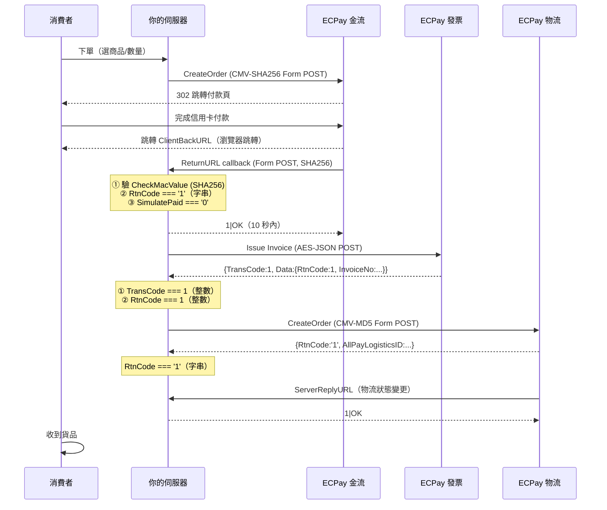

> 對應 ECPay API 版本 | 基於 PHP SDK ecpay/sdk | 最後更新：2026-03

> ℹ️ 本文為流程指引，不含 API 參數表。最新參數規格請參閱各服務對應的 guide 及 references/。

# 跨服務整合場景

> **本指南與各 Service Guide 的關係**：本指南提供**端到端完整流程**（適合先了解全局再深入）。
> 各服務的實作細節見：
> - [guides/01 AIO 金流](./01-payment-aio.md) — 金流細節
> - [guides/04 B2C 發票](./04-invoice-b2c.md) — 發票細節
> - [guides/06 國內物流](./06-logistics-domestic.md) — 國內物流細節（場景一~四使用）
> - [guides/07 全方位物流](./07-logistics-allinone.md) — 全方位物流細節
>
> **建議閱讀順序**：先讀本指南了解全貌（30 分鐘），再依需要深入對應的 Service Guide。

## 概述

實際電商運作通常需要同時串接金流 + 發票 + 物流。本指南提供四個完整的端到端場景，涵蓋從下單到退貨的全部流程。

## 場景一：電商標準流程（收款 + 發票 + 出貨）

適用：一般線上購物，消費者下單 → 付款 → 開發票 → 出貨 → 收貨。

### 預估時間分解

| 環節 | 對應指南 | 預估時間 |
|------|---------|:-------:|
| AIO 收款 + Callback | [guides/01](./01-payment-aio.md) | 45m |
| B2C 發票開立 | [guides/04](./04-invoice-b2c.md) | 30m |
| 國內物流建單 | [guides/06](./06-logistics-domestic.md) | 30m |
| Callback 統一處理 | [guides/21](./21-webhook-events-reference.md) | 20m |
| 合計 | — | ~2h |

### 完整流程



### 環境變數設定

```bash
# .env 檔案（勿加入版本控制）
# ⚠️ 三個服務使用三組獨立帳號，即使 MerchantID 相同（發票與物流 B2C 同為 2000132），HashKey / HashIV 也完全不同，不可混用

# 金流（AIO / 站內付 2.0）— 加密方式：CMV-SHA256；SDK 初始化無需設定 hashMethod（預設值）
ECPAY_PAYMENT_MERCHANT_ID=3002607
ECPAY_PAYMENT_HASH_KEY=pwFHCqoQZGmho4w6
ECPAY_PAYMENT_HASH_IV=EkRm7iFT261dpevs

# 電子發票 B2C/B2B — 加密方式：AES-JSON；SDK 初始化無需設定 hashMethod
ECPAY_INVOICE_MERCHANT_ID=2000132
ECPAY_INVOICE_HASH_KEY=ejCk326UnaZWKisg
ECPAY_INVOICE_HASH_IV=q9jcZX8Ib9LM8wYk

# 國內物流 B2C — 加密方式：CMV-MD5；⚠️ SDK 初始化必須明確加 'hashMethod' => 'md5'
# MerchantID 與發票相同（2000132），但 HashKey / HashIV 完全不同！
ECPAY_LOGISTICS_MERCHANT_ID=2000132
ECPAY_LOGISTICS_HASH_KEY=5294y06JbISpM5x9
ECPAY_LOGISTICS_HASH_IV=v77hoKGq4kWxNNIS
```

> 以上為測試帳號。正式環境請替換為您的正式帳號。
>
> ⚠️ **SDK 初始化差異**：金流與發票的 `Factory` 不設定 `hashMethod`（各自預設 SHA256 / AES）；**國內物流必須加 `'hashMethod' => 'md5'`**，否則 CheckMacValue 計算錯誤。複製其他服務的 `Factory` 初始化代碼時務必確認此設定。

### 步驟 1：建立 AIO 訂單

完整建單範例見 [guides/01 §建立訂單](./01-payment-aio.md)。

- SDK 範例：`scripts/SDK_PHP/example/Payment/Aio/CreateOrder.php`
- 加密方式：CMV-SHA256（見 [guides/13](./13-checkmacvalue.md)）
- 必要欄位：`MerchantTradeNo`、`TotalAmount`、`ReturnURL`、`ChoosePayment`

### 步驟 2：處理付款通知（ReturnURL）

完整 callback 處理見 [guides/01 §接收付款結果](./01-payment-aio.md)。

- SDK 範例：`scripts/SDK_PHP/example/Payment/Aio/GetCheckoutResponse.php`
- 必須驗證 `RtnCode=1` 且 `SimulatePaid=0` 後才進行後續步驟
- 必須立即回應 `1|OK`，發票和物流操作應放入非同步佇列

### 步驟 3：開立 B2C 發票

完整開立範例見 [guides/04 §開立發票](./04-invoice-b2c.md)。

- SDK 範例：`scripts/SDK_PHP/example/Invoice/B2C/Issue.php`
- 加密方式：AES-JSON（見 [guides/14](./14-aes-encryption.md)）
- 注意：發票的 MerchantID / HashKey / HashIV 與金流不同

### 步驟 4：建立物流訂單

完整建單範例見 [guides/06 §建立訂單](./06-logistics-domestic.md)。

- SDK 範例：`scripts/SDK_PHP/example/Logistics/Domestic/CreateCvs.php`
- 加密方式：CMV-MD5（見 [guides/13](./13-checkmacvalue.md)）
- 注意：物流的 MerchantID / HashKey / HashIV 又與金流和發票不同（測試環境中物流 B2C 與發票共用 MerchantID `2000132`，但 HashKey / HashIV 不同；正式環境三者完全獨立）

### 跨服務整合要點

| 面向 | 金流 | 發票 | 物流 |
|------|------|------|------|
| **MerchantID** | 獨立帳號 | 獨立帳號 | 獨立帳號 |
| **認證/協定** | CMV-SHA256 | AES-JSON | CMV-MD5 |
| **Callback URL** | ReturnURL | 發票 Callback | ServerReplyURL |

- **三組不同帳號**：金流、發票、物流各有獨立的 MerchantID / HashKey / HashIV，務必分開管理
- **付款確認後再開票出貨**：務必在 RtnCode=1 且 SimulatePaid=0 後才執行
- **高併發場景**：當跨服務 callback 量大或需批次開票/建單時，參見 [guides/22 效能與擴展](./22-performance-scaling.md) 的佇列架構與限流策略

> ⚠️ 跨服務流程中，所有 `MerchantTradeDate` 必須使用 **UTC+8 台灣時間**（格式：`yyyy/MM/dd HH:mm:ss`）。

### 跨服務 Callback 時序

三個服務的 callback 各自獨立、無順序保證，以下為典型時序：

```
消費者完成付款
    │
    ├─── 金流 ReturnURL ──────────────────────────► 你的 Server
    │    (即時，付款完成後數秒)                        │
    │                                                 ├→ 驗證 CheckMacValue
    │                                                 ├→ 回應 "1|OK"
    │                                                 └→ 更新訂單狀態
    │
    ├─── 發票 Callback（若有）────────────────────► 你的 Server
    │    (非即時，可能延遲數秒至數分鐘)                 │
    │                                                 ├→ 直接解析 $_POST 參數（無 AES/CMV；`AllowanceByCollegiate` 除外，該 Callback 含 MD5 CheckMacValue）
    │                                                 ├→ 回應 "1|OK"
    │                                                 └→ 記錄發票號碼
    │
    └─── 物流 ServerReplyURL ────────────────────► 你的 Server
         (出貨後，物流狀態變更時)                       │
                                                      ├→ 驗證 CheckMacValue
                                                      ├→ 回應 "1|OK"
                                                      └→ 更新出貨狀態
```

#### Callback 回應格式差異

> 各服務 Callback 回應格式完整對照表見 [guides/21-webhook-events-reference.md](./21-webhook-events-reference.md) §Callback 總覽表。
> 重點提醒：AIO 金流回應 `1|OK`，國內物流回應 `1|OK`，站內付 2.0 / 信用卡幕後授權回應 `1|OK`，全方位/跨境物流回應 AES 加密 JSON，電子票證回應 AES 加密 JSON + ECTicket 式 CMV。

#### 冪等性與事件驅動建議

- 每個 callback 都應實作冪等性（用 MerchantTradeNo/AllPayLogisticsID 作 unique key）
- ECPay 可能重送 callback（如 server 未回應），務必用 upsert 避免重複處理
- 建議架構：收到 callback → 驗證 → 推入佇列 → 立即回應 → 非同步處理業務邏輯

#### 延伸參考

- 詳細 callback 欄位定義：見 [guides/21-webhook-events-reference.md](./21-webhook-events-reference.md)
- 錯誤碼排查：見 [guides/20-error-codes-reference.md](./20-error-codes-reference.md)

## 場景二：訂閱制（定期定額 + 每期開發票）

適用：SaaS 月費、會員訂閱、雜誌訂閱等。

### 完整流程

```
步驟 1: 建立 AIO 定期定額訂單
步驟 2: 首次付款成功 → 開立首期發票
步驟 3: 每月 PeriodReturnURL 收到授權結果
步驟 4: 授權成功 → 開立當期發票
步驟 5: 授權失敗 → 通知使用者 / 重新授權 / 取消
```

### 步驟 1：建立定期定額

必填欄位：`PeriodAmount`、`PeriodType`（D/M/Y）、`Frequency`、`ExecTimes`、`PeriodReturnURL`。

> 完整 PHP 範例請參考：`scripts/SDK_PHP/example/Payment/Aio/CreatePeriodicOrder.php`

### 步驟 3-4：每期通知 + 開票

PeriodReturnURL 接收每期授權結果：`RtnCode=1` 表示本期授權成功，此時呼叫發票開立 API（見場景一步驟 3）。

### 步驟 5：失敗處理

Action 欄位：`ReAuth`（重新授權）或 `Cancel`（取消訂閱）。連續 6 次授權失敗會自動取消。

> 完整 PHP 範例請參考：`scripts/SDK_PHP/example/Payment/Aio/CreditCardPeriodAction.php`

## 場景三：綁卡快速付款（站內付2.0 + 發票）

適用：常客快速結帳、外送平台、計程車。

### 完整流程

```
步驟 1: 站內付2.0 綁卡（首次）
步驟 2: 日後用 BindCardID 扣款
步驟 3: 扣款成功 → 開立發票
```

### 步驟 1：綁卡

> 參考：`scripts/SDK_PHP/example/Payment/Ecpg/GetTokenbyBindingCard.php` → `CreateBindCard.php`

首次綁卡流程見 [guides/02-payment-ecpg.md](./02-payment-ecpg.md#綁卡付款流程)

### 步驟 2：扣款

必填欄位：`BindCardID`（綁卡後取得）、`OrderInfo.MerchantTradeNo`、`OrderInfo.TotalAmount`、`ConsumerInfo.MerchantMemberID`。資料需 AES-JSON 加密（見 [guides/14](./14-aes-encryption.md)）。

> 完整 PHP 範例請參考：`scripts/SDK_PHP/example/Payment/Ecpg/CreatePaymentWithCardID.php`

### 步驟 3：扣款成功後開票

同場景一步驟 3。

## 場景四：退款 + 折讓 + 退貨（完整逆向流程）

適用：消費者退貨退款全流程。

### 完整流程

```
步驟 1: 信用卡退款（AIO: DoAction Action=R / 站內付2.0: DoAction Action=R）
步驟 2: 發票折讓（部分退款）或作廢（全額退款）
步驟 3: 物流退貨（若有實體商品）
步驟 4: 記錄完整退款軌跡（金額、發票、物流單號、時間戳）
```

> ⚠️ 發票作廢有時間限制，建議退款時同步作廢。站內付2.0 退款使用 `ecpayment` domain 的 DoAction API。

### 步驟 1：退款

呼叫 DoAction API，`Action=R` 退款，`Action=N` 取消授權。需提供 `MerchantTradeNo`、`TradeNo`（綠界交易編號）、`TotalAmount`。

> 完整 PHP 範例可參考：`scripts/SDK_PHP/example/Payment/Aio/Capture.php`（官方範例示範 `Action='C'`；若要退款請改為 `Action='R'`）

### 步驟 2A：部分退款 → 折讓

必填欄位：`InvoiceNo`、`InvoiceDate`、`AllowanceAmount`、`Items`（含 ItemSeq/ItemName/ItemCount/ItemWord/ItemPrice/ItemAmount）。

> 完整 PHP 範例請參考：`scripts/SDK_PHP/example/Invoice/B2C/Allowance.php`

### 步驟 2B：全額退款 → 作廢

必填欄位：`InvoiceNo`、`InvoiceDate`、`Reason`。

> 完整 PHP 範例請參考：`scripts/SDK_PHP/example/Invoice/B2C/Invalid.php`

### 步驟 3：物流退貨

必填欄位：`GoodsAmount`、`ServiceType`（超商類型代碼）、`SenderName`、`ServerReplyURL`。

> 完整 PHP 範例請參考：`scripts/SDK_PHP/example/Logistics/Domestic/ReturnFamiCvs.php`（超商）或 `scripts/SDK_PHP/example/Logistics/Domestic/ReturnHome.php`（宅配）

## 跨服務帳號對照

> 各服務測試帳號見 SKILL.md §測試帳號 或 [guides/00 §測試帳號](./00-getting-started.md)。

**重點**：金流/物流/發票使用**不同的** MerchantID 和 HashKey/HashIV。正式環境中取決於申請方式，務必分開管理。

## 場景五：B2B 發票整合

企業間交易需要 B2B 發票，流程與 B2C 不同。

### 交換模式 vs 存證模式

| 面向 | 交換模式 | 存證模式 |
|------|---------|---------|
| 買方接收 | 透過加值中心交換 | 直接存證於電子發票整合平台 |
| 確認步驟 | 需要買方確認（IssueConfirm） | 不需確認 |
| 適用場景 | 雙方都有加值中心 | 一般企業交易 |
| API 數量 | ~34 個（含 Confirm/Reject 系列） | ~17 個 |

### B2B 電商典型流程

```
1. 收款（AIO 或站內付2.0）
2. 開立 B2B 發票（Issue）
3. [交換模式] 等待買方確認（IssueConfirm）
4. 折讓/作廢：Allowance / Invalid
5. [交換模式] 等待對方確認折讓/作廢
```

> **選擇建議**：如不確定，先用**存證模式**（較簡單、不需確認流程）。

詳細 API 見 [guides/05-invoice-b2b.md](./05-invoice-b2b.md)

## 統一環境設定

跨服務帳號需分開管理（金流 SHA256、物流 MD5、發票 AES），以環境變數區分：

```
ECPAY_PAYMENT_MERCHANT_ID / ECPAY_PAYMENT_HASH_KEY / ECPAY_PAYMENT_HASH_IV
ECPAY_LOGISTICS_MERCHANT_ID / ECPAY_LOGISTICS_HASH_KEY / ECPAY_LOGISTICS_HASH_IV
ECPAY_INVOICE_MERCHANT_ID / ECPAY_INVOICE_HASH_KEY / ECPAY_INVOICE_HASH_IV
```

> 完整環境設定範例見 [guides/00](./00-getting-started.md) 和 [guides/23](./23-multi-language-integration.md)。

## 跨服務錯誤恢復

實際運營中，跨服務整合最常遇到「部分成功」——某個服務成功但另一個失敗。

### 常見錯誤場景與處理原則

| 錯誤場景 | 核心原則 | 處理方式 |
|---------|---------|---------|
| 付款成功，發票開立失敗 | 付款不可撤銷，發票需重試 | 記錄狀態 `paid_invoice_failed` → 指數退避重試（1min/5min/30min，最多 3 次）→ 超限警示人工處理。⚠️ 台灣法規要求 48 小時內完成開立 |
| 付款成功，物流建單失敗 | 通常是參數問題 | 優先檢查參數（收件人資料、門市代碼）→ 修正後重試 → 警示 + 備用物流方案 |
| Callback 到達順序不一致 | 各 handler 獨立處理 | 各 callback 只更新自己的資料表 → 每次處理後檢查「全部就緒」→ 全部就緒時更新訂單為 completed |

> 錯誤恢復的核心原則：**冪等性重試 + 補償動作 + 最終一致性檢查**。

## 跨服務補償動作對照表

跨服務整合（付款 + 發票 + 物流）任一步驟失敗時，需要反向補償已完成的步驟：

| 步驟 | 正向動作 | 補償動作 | 失敗影響 |
|------|---------|---------|---------|
| 1. 建立訂單 | 資料庫建立訂單記錄 | 標記訂單為已取消 | 僅本地影響 |
| 2. 付款 | AIO/站內付2.0 收款 | 呼叫退款 API（AIO: `DoAction` Action=R / 站內付2.0: 退款端點） | 需要退款處理 |
| 3. 開立發票 | B2C/B2B 開立發票 | 呼叫作廢發票 API（`Invalid`） | 需要作廢處理 |
| 4. 建立物流 | 建立物流訂單 | 聯繫物流取消（部分物流不支援 API 取消） | 可能需人工介入 |

### 注意事項

- **冪等性**：每個步驟必須可重複執行，避免重複扣款或重複開票
- **超時處理**：ECPay callback 可能延遲，設定合理的等待超時（建議 30 分鐘）
- **部分失敗**：發票作廢和物流取消可能需要人工介入，建議記錄每步驟執行狀態方便追蹤

### 故障時補償原則

1. **金流優先**：金流是核心，發票和物流失敗不應阻擋金流處理
2. **延後補償**：發票和物流失敗可重試或人工處理，不需要即時復原金流
3. **記錄所有失敗**：每個步驟的結果都應記錄，方便事後排查
4. **不要自動退款**：除非消費者明確要求，不應因發票/物流失敗而自動退款

## 相關文件

- 金流 AIO：[guides/01-payment-aio.md](./01-payment-aio.md)
- 站內付 2.0：[guides/02-payment-ecpg.md](./02-payment-ecpg.md)
- B2C 發票：[guides/04-invoice-b2c.md](./04-invoice-b2c.md)
- 國內物流：[guides/06-logistics-domestic.md](./06-logistics-domestic.md)
- 效能與擴展：[guides/22-performance-scaling.md](./22-performance-scaling.md)
- Callback 參考：[guides/21-webhook-events-reference.md](./21-webhook-events-reference.md)
- API 規格（金流）：`references/Payment/全方位金流API技術文件.md`
- API 規格（發票）：`references/Invoice/B2C電子發票介接技術文件.md`
- API 規格（物流）：`references/Logistics/物流整合API技術文件.md`
